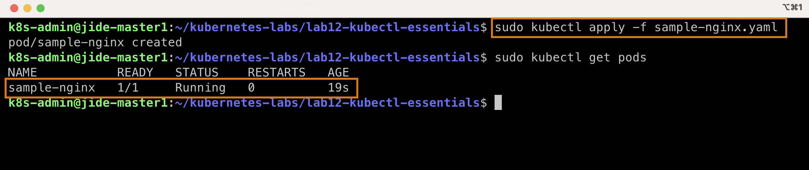
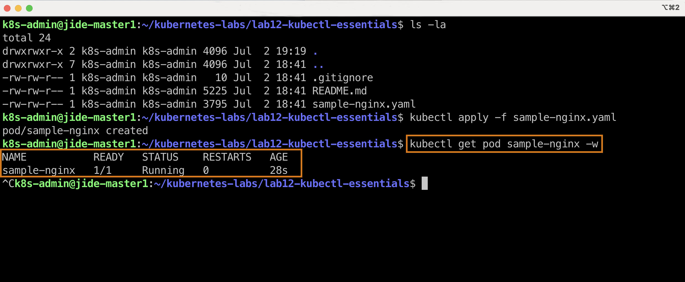
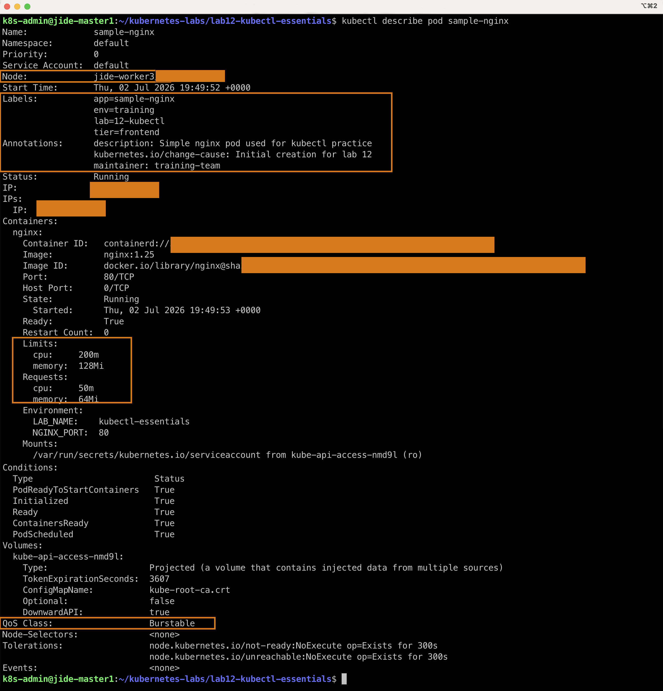
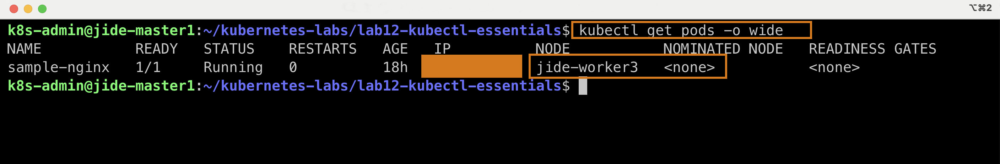
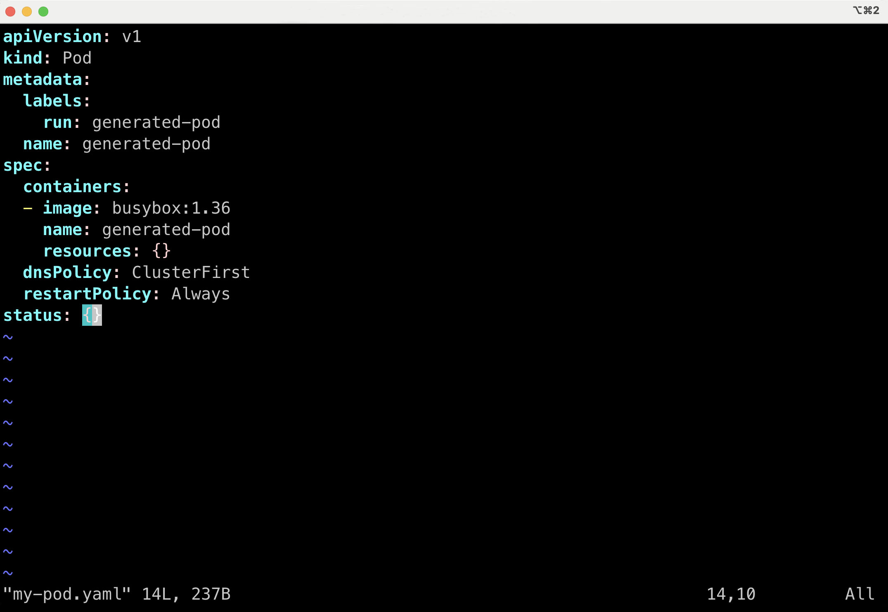
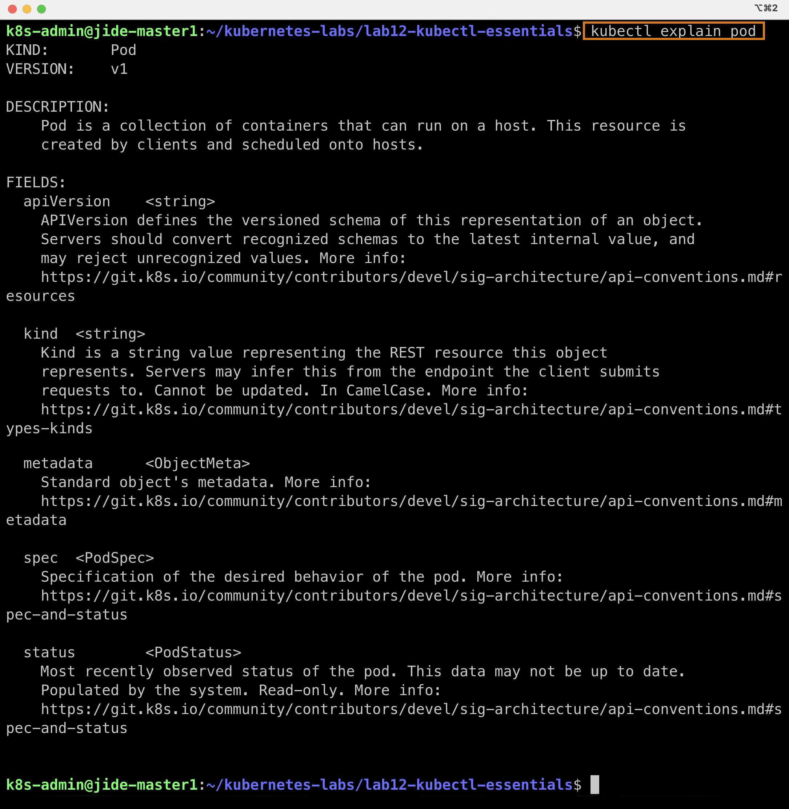
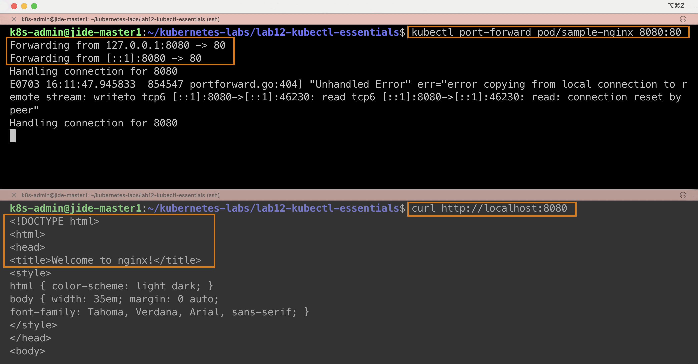
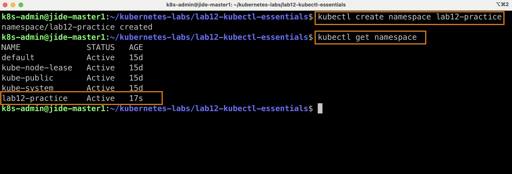
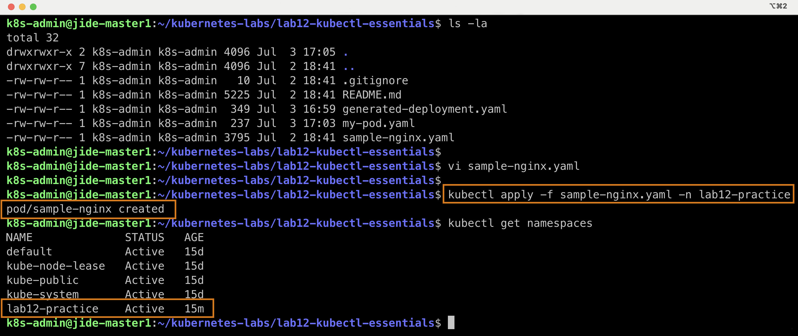
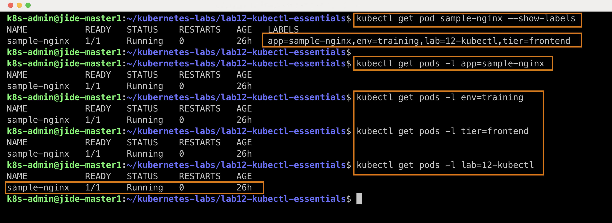

# Kubernetes Lab 12 – kubectl Essentials

A hands-on Kubernetes lab focused on mastering the core `kubectl` commands used by Kubernetes Administrators, DevOps Engineers, and Site Reliability Engineers (SREs).

---

# Project Overview

This lab demonstrates the practical use of **kubectl**, Kubernetes' primary command-line interface, for managing workloads inside a Kubernetes cluster.

The exercises cover the complete lifecycle of a Pod—from creation and inspection to debugging, networking, namespaces, labels, annotations, and cleanup.

The lab was completed on a self-hosted **High Availability Kubernetes Cluster** running inside my Proxmox home lab.


# Objectives

- Deploy a Pod using a YAML manifest
- Monitor Pod creation
- Inspect Kubernetes resources
- Understand Labels and Annotations
- View Pod details
- Retrieve logs
- Execute commands inside containers
- Access applications using Port Forwarding
- Generate Kubernetes manifests
- Work with Namespaces
- Verify Pod scheduling
- Clean up Kubernetes resources

## 1. Deploying a Pod

Created an NGINX Pod using a Kubernetes manifest.

```bash
kubectl apply -f sample-nginx.yaml
```

Verified the Pod was successfully created.

```bash
kubectl get pods
```

### Screenshot




## 2. Watching Pod Creation

Used the watch flag to monitor the Pod lifecycle.

```bash
kubectl get pod sample-nginx -w
```

Although my image was already cached, Kubernetes immediately transitioned to the **Running** state.

### Screenshot




## 3. Inspecting Resources

Used the describe command to inspect every aspect of the Pod.

```bash
kubectl describe pod sample-nginx
```

This command reveals:

- Labels
- Annotations
- Node
- Pod IP
- Resource Limits
- Resource Requests
- Environment Variables
- Mounted Volumes
- Events

### Screenshot




## 4. Understanding Scheduling

The Kubernetes Scheduler automatically selected an available Worker Node.

```bash
kubectl describe pod sample-nginx
```

Notice the Pod was scheduled on **jide-worker3** instead of either control plane node.

### Screenshot




## 6. Viewing Logs

```bash
kubectl logs sample-nginx
```

```bash
kubectl logs sample-nginx --tail=40
```

```bash
kubectl logs sample-nginx --since=5m
```

### Screenshots

**Generated Pod**


**Kubectl Explain**


**Worker Node Scheduling**


## 8. Port Forwarding

```bash
kubectl port-forward pod/sample-nginx 8080:80
```

Opened a browser and verified the default NGINX page.

### Terminal




## 10. Working with Namespaces

Created a dedicated namespace.

```bash
kubectl create namespace lab12-practice
```

Verified the namespace.

### Screenshot




Applied the Pod to the namespace.

```bash
kubectl apply -f sample-nginx.yaml -n lab12-practice
```

Verified the Pod.

```bash
kubectl get pods -n lab12-practice
```

### Screenshot




## 11. Labels and Annotations

Queried Pods using Labels.

```bash
kubectl get pods -l lab=12-kubectl
```

### Screenshot




The screenshots demonstrate each major milestone throughout the lab.

---

# Key Concepts:

- Kubernetes Pods
- YAML Manifests
- kubectl Workflow
- Labels
- Annotations
- Namespaces
- Scheduler
- Worker Nodes
- Control Plane
- JSONPath
- Port Forwarding
- Container Logs
- Interactive Container Access
- Resource Requests
- Resource Limits

---

# Skills Demonstrated

- Kubernetes Administration
- Linux CLI
- YAML Authoring
- Troubleshooting
- Resource Inspection
- Cluster Navigation
- Networking Fundamentals
- Namespace Isolation
- Container Debugging
- Infrastructure Documentation

---

# Lessons Learned

This lab reinforced the importance of using `kubectl` as the primary interface for interacting with Kubernetes clusters.

I gained practical experience deploying, inspecting, troubleshooting, and managing workloads while developing a deeper understanding of Kubernetes scheduling, networking, namespaces, labels, and resource management.

Completing these exercises on my own High Availability home lab strengthened my confidence in performing real-world Kubernetes administrative tasks.

---

# Author

**Babajide Ajisafe**
© 2026 All Rights Reserved.

