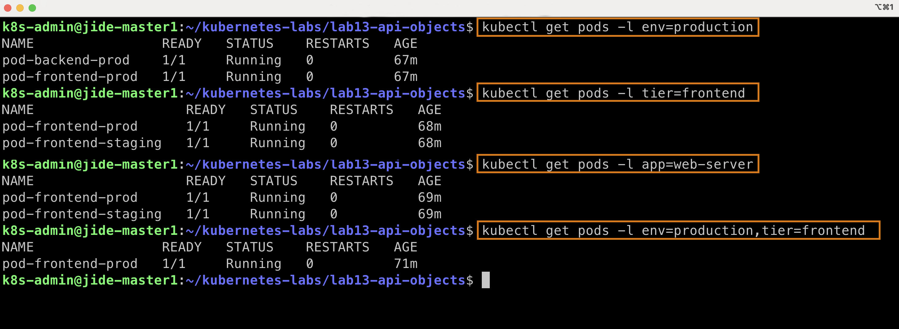
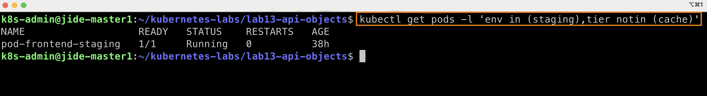
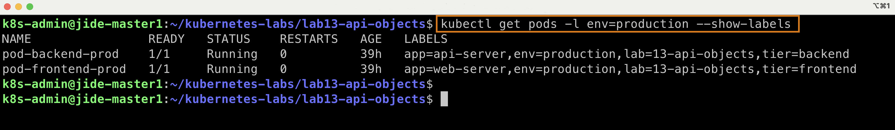
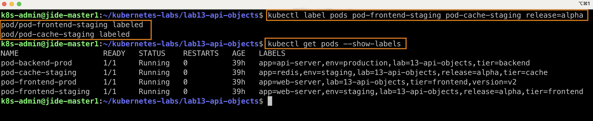
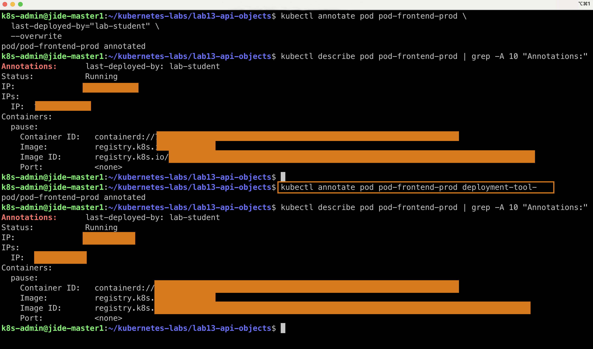
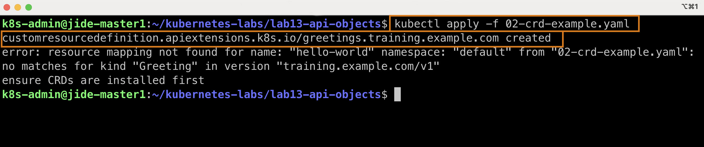
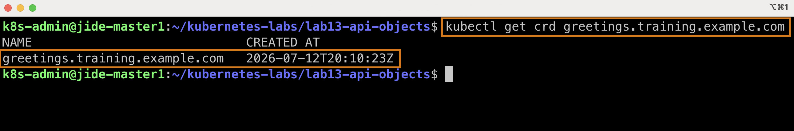
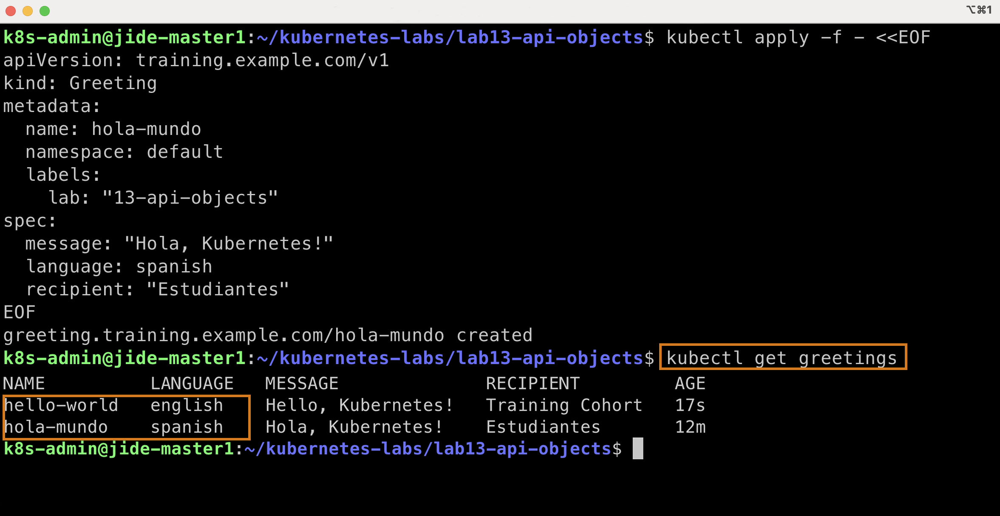
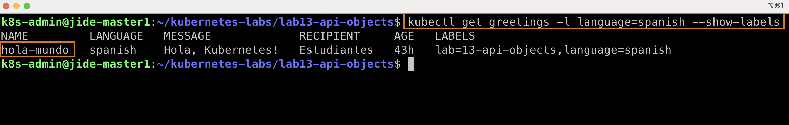

# Lab 13 – Labels, Selectors, Annotations, and Custom Resource Definitions (CRDs)

## Objective
The goal of this lab was to understand how Kubernetes uses labels and selectors to organize, identify, and manage resources, and to learn how the Kubernetes API can be extended using Custom Resource Definitions (CRDs).

# Part 1 – Labels
Labels are key-value pairs attached to Kubernetes objects.
Example:
labels:
  app: web-server
  env: production
  tier: frontend
Labels are stored under:
metadata:
  labels:
Labels provide a way to categorize and identify resources.

**Examples:**
app=web-server
env=production
tier=frontend
lab=13-api-objects

**Verified the labels attached to each Pod.

kubectl get pods --show-labels

### Screenshot



---

# Part 2 – Equality-Based Selectors

Selectors allow Kubernetes to find resources based on labels.

**Examples:**
kubectl get pods -l env=production
kubectl get pods -l tier=frontend
kubectl get pods -l app=web-server
Multiple selectors can be combined using commas.

**Verified that Kubernetes can filter Pods using equality-based label selectors.**
kubectl get pods -l env=production,tier=frontend
A comma represents AND logic.

Meaning:
env=production AND tier=frontend

### Screenshot


---

# Part 3 – Set-Based Selectors
Set-based selectors provide more advanced filtering.
Examples:
kubectl get pods -l 'env in (production,staging)'
kubectl get pods -l 'tier notin (frontend)'
kubectl get pods -l 'tier'
Useful operators:
in
notin
exists
These selectors are heavily used by Deployments, ReplicaSets, Services, and NetworkPolicies.

Verified that Kubernetes can filter Pods using set-based label selectors.

```bash
kubectl get pods -l 'env in (staging),tier notin (cache)'
```

### Screenshot



---

# Part 4 – Viewing Labels
Labels can be displayed using:
kubectl get pods --show-labels
This command allows verification of labels attached to resources.

Verified the labels attached to the selected Pods.

```bash
kubectl get pods -l env=production --show-labels
```

### Screenshot



---

# Part 5 – Managing Labels Imperatively
Labels can be added, modified, or removed from running resources.
Add:
kubectl label pod pod-frontend-prod version=v2
Modify:
kubectl label pod pod-frontend-prod env=prod-v2 --overwrite
Remove:
kubectl label pod pod-frontend-prod env-
Key Learning:
Changing labels immediately affects selector results.

Verified that labels can be added, modified, removed, and applied to multiple Pods without recreating the resources.

```bash
kubectl get pods --show-labels
```

### Screenshot 



---

# Part 6 – Annotations
Annotations are metadata used for documentation and tooling.
Example:
kubectl annotate pod pod-frontend-prod deployment-tool=kubectl
Difference:
Labels:
Used for selection and grouping.
Annotations:
Used for informational metadata.
Not used by selectors.

Verified that annotations can be added, updated, and removed without changing how Kubernetes selects the Pod.

```bash
kubectl describe pod pod-frontend-prod | grep -A 10 "Annotations:"
```

### Screenshot



---

# Part 7 – Custom Resource Definitions (CRDs)

A Custom Resource Definition (CRD) extends the Kubernetes API by introducing a brand-new resource type. This allows Kubernetes to manage custom objects just like built-in resources.

Built-in Kubernetes resources include:

- Pod
- Deployment
- Service
- ConfigMap

The custom resource introduced in this lab is:

```yaml
kind: Greeting
```

Installed the Custom Resource Definition (CRD) that extends the Kubernetes API with a new resource type called **Greeting**.

```bash
kubectl apply -f 02-crd-example.yaml
```

### Screenshot



After installing the CRD, Kubernetes recognized a new API resource named **Greeting**, demonstrating that the Kubernetes API can be extended beyond its built-in object types.

Verified that the Custom Resource Definition (CRD) was successfully registered with the Kubernetes API.

```bash
kubectl get crd greetings.training.example.com
```
### Screenshot



---

# Part 8 – Creating Custom Resources
Created:

```text
hello-world
hola-mundo
```

### Screenshot



Resource Example:

```yaml
apiVersion: training.example.com/v1
kind: Greeting
```

These objects behaved similarly to native Kubernetes resources.

Examples:

```bash
kubectl get greetings
kubectl get gt
kubectl describe greeting hello-world
```
---

# Part 9 – Schema Validation

The Greeting CRD included validation rules.

Valid languages:

* english
* spanish
* french
* yoruba
* swahili

```yaml
language: klingon
```

### Screenshot


resulted in:

```text
Unsupported value: "klingon"
```

Key Learning:

CRDs support API-level validation using OpenAPI schemas.

---

# Part 10 – Labels on Custom Resources

Labels work on custom resources exactly as they do on Pods.

Added labels to the Greeting resources:

```bash
kubectl label greeting hola-mundo language=spanish
kubectl label greeting hello-world language=english
```

Verified the labels using a selector:

```bash
kubectl get greetings -l language=spanish --show-labels
```

### Screenshot



Key Learning:

Labels are a universal Kubernetes feature and can be applied to both built-in resources and Custom Resources (CRDs). This allows selectors to work consistently across all Kubernetes object types.


# Key Takeaways
By completing this lab I learned:
How labels identify Kubernetes objects.
How selectors locate resources using labels.
Difference between equality-based and set-based selectors.
How annotations differ from labels.
How to add, modify, and remove labels.
How Kubernetes APIs can be extended using CRDs.
How to create and manage custom resources.
How schema validation protects API integrity.
How labels and selectors work on both native and custom resources.

# Skills Practiced
kubectl
Labels
Selectors
Annotations
CRDs
Custom Resources
OpenAPI Validation
Resource Discovery
Kubernetes API Extension

# Outcome
Successfully deployed and managed labeled Pods, created a Custom Resource Definition (CRD), created multiple Greeting custom resources, validated schema enforcement, and used selectors across both native and custom Kubernetes objects.

Created By:

**Babajide Ajisafe** Cloud | DevOps | Kubernetes Engineer

GitHub: https://github.com/bojide Linkedin: https://linkedin.com/in/babajide-ajisafe

Passionate about designing, automating, and managing scalable cloud-native infrastructure using modern DevOps and Kubernetes technologies.
