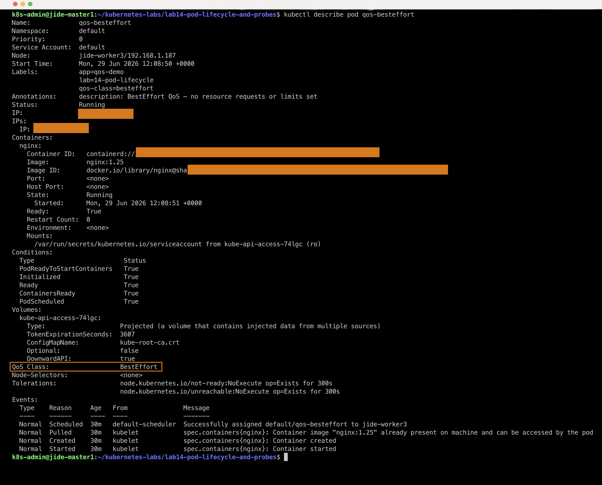
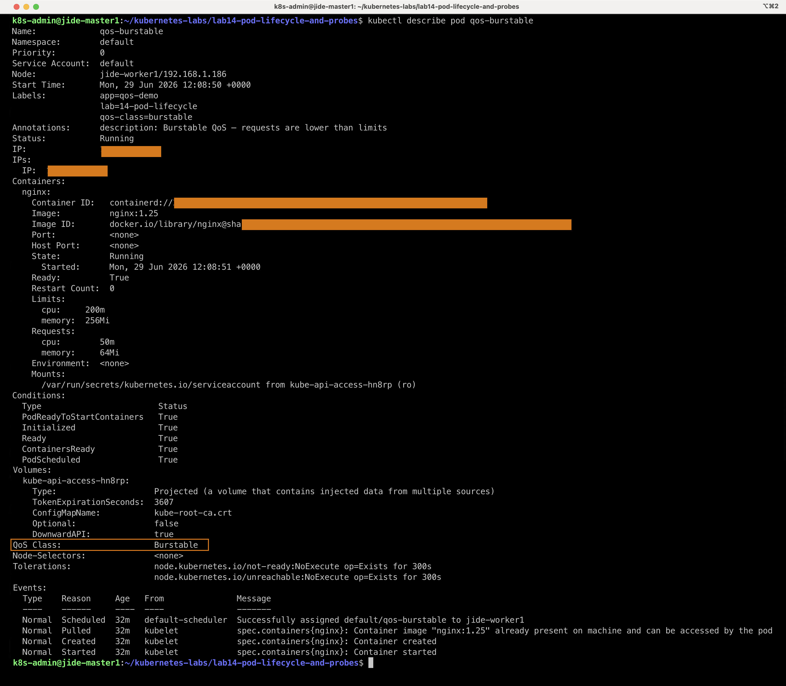
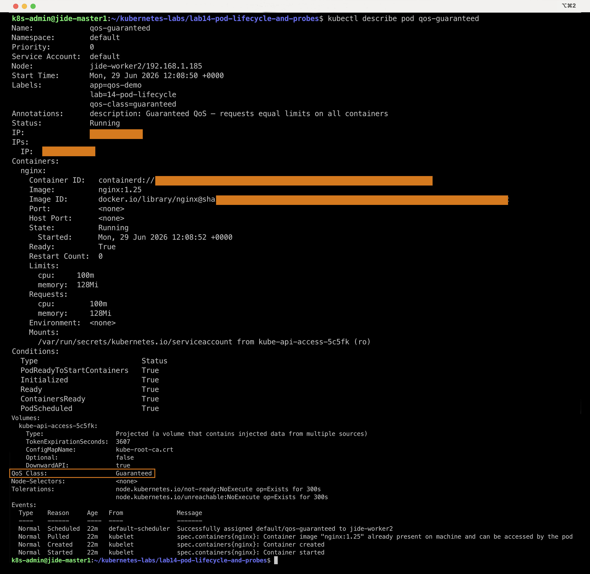
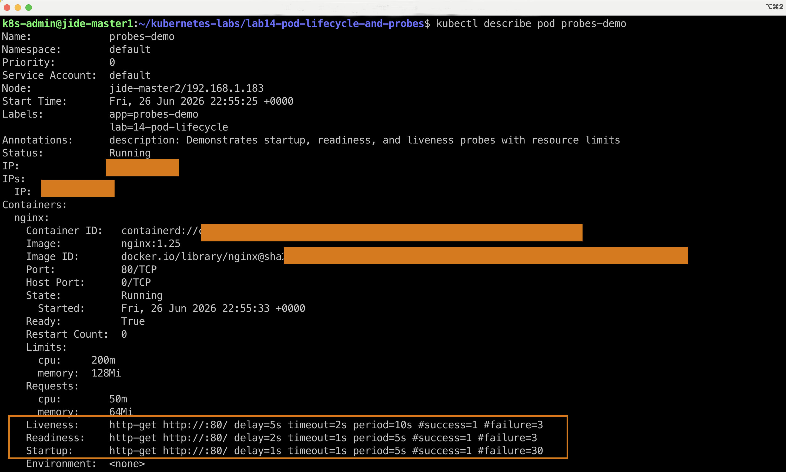

# Pod Lifecycle, Health Checks & Probes #

## Overview

This section demonstrates how Kubernetes assigns Quality of Service (QoS) classes based on CPU and memory requests and limits.

Three pods were deployed:

- BestEffort
- Burstable
- Guaranteed

---

## 1. BestEffort QoS

A BestEffort pod has **no CPU or memory requests or limits** configured.

### Command

```bash
kubectl describe pod qos-besteffort
```

### Result



### Observation

- QoS Class: **BestEffort**
- No resource requests
- No resource limits
- First pod to be evicted during memory pressure

---

## 2. Burstable QoS

Burstable pods define resource requests that are lower than their limits.

### Command

```bash
kubectl describe pod qos-burstable
```

### Result




### Observation

- QoS Class: **Burstable**
- Resource requests configured
- Resource limits configured
- Higher priority than BestEffort

---

## 3. Guaranteed QoS

Guaranteed pods have identical CPU and memory requests and limits.

### Command

```bash
kubectl describe pod qos-guaranteed
```

### Result



### Observation

- QoS Class: **Guaranteed**
- Requests equal limits
- Highest scheduling priority
- Last pod to be evicted


## Pod Lifecycle

A short-lived pod was deployed to observe the normal Kubernetes pod lifecycle.

### Command
kubectl get pod short-lived -w

Result
Completed

### Verify Logs

kubectl logs short-lived


### Output

Running for 10 seconds
Done

### Verify Pod Phase

kubectl get pod short-lived -o jsonpath='{.status.phase}{"\n"}'


### Output

Succeeded

### Observation
 - The container started successfully.
 - The application completed normally.
 - Exit code was 0.
 - Because restartPolicy: Never was configured, Kubernetes did not restart the pod.
 - The final Pod Phase was Succeeded.

## Probes: Startup, Readiness, and Liveness

This pod demonstrates how Kubernetes uses Startup, Readiness, and Liveness probes to monitor application health.

### Command


kubectl describe pod probes-demo (result below)




### Observation
- Startup probe checks whether the application has started successfully.
- Readiness probe controls whether the pod can receive traffic.
- Liveness probe determines whether Kubernetes should restart the container.
- Restart Count remained 0, confirming all probes passed successfully.

### What I Learned

- Learned how Kubernetes assigns QoS classes.
- Used `kubectl describe` to inspect pod resource allocation.
- Compared BestEffort, Burstable and Guaranteed pods.
- Understood Kubernetes eviction priority during memory pressure.


## Skills Demonstrated

- Kubernetes Pods
- Pod Lifecycle
- Startup Probes
- Readiness Probes
- Liveness Probes
- Init Containers
- QoS Classes
- Resource Requests and Limits
- CrashLoopBackOff Troubleshooting
- kubectl describe
- kubectl logs
- Kubernetes Event Analysis
- Pod Status Inspection


Author:

**Babajide Ajisafe**

- GitHub: https://github.com/bojide

- LinkedIn: https://linkedin.com/in/babajide-ajisafe

