# Lab 15 – ConfigMaps, Secrets, and the Downward API

## Overview

This lab demonstrates how Kubernetes manages application configuration and sensitive information using **ConfigMaps** and **Secrets**, and how the **Downward API** exposes Pod metadata to running containers.

During this lab I:

- Created a dedicated namespace
- Created and inspected a ConfigMap
- Created and verified a Secret
- Injected configuration as environment variables
- Mounted ConfigMaps and Secrets as files
- Used the Downward API to expose Pod metadata
- Verified mounted files and environment variables inside running Pods

---

# Prerequisites

- Kubernetes cluster
- kubectl configured
- Namespace isolation

---

# Step 1 — Create Namespace

Created a dedicated namespace for the lab.

```bash
kubectl create namespace cm-secrets-lab
kubectl get namespace cm-secrets-lab
```

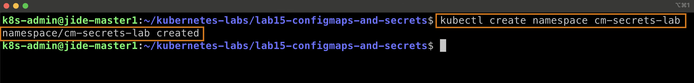

---

# Step 2 — Create ConfigMap

Applied the ConfigMap manifest containing application configuration.

```bash
kubectl apply -f 01-configmap.yaml
```

Verified the ConfigMap.

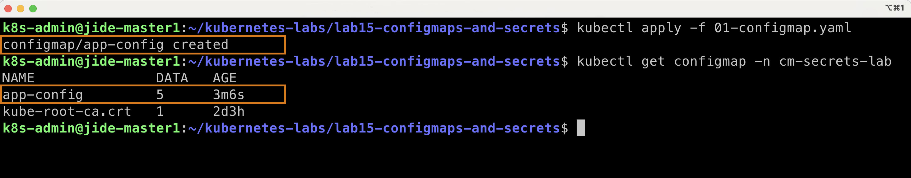

---

# Step 3 — Create Secret

Applied the Secret manifest.

```bash
kubectl apply -f 02-secret.yaml
```

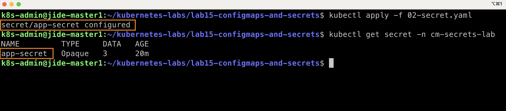

---

## Verify Kubernetes Base64 Encoding

Retrieved the Secret to verify that Kubernetes stores Secret data in the **data** field using Base64 encoding.

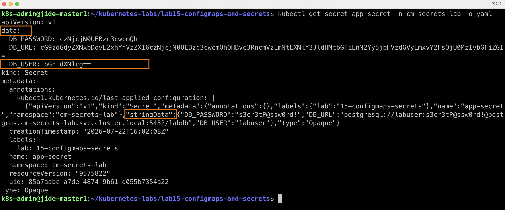

---

# Step 4 — Environment Variable Injection

Created a Pod that imports ConfigMap and Secret values as environment variables.

```bash
kubectl apply -f 03-pod-env-injection.yaml
```

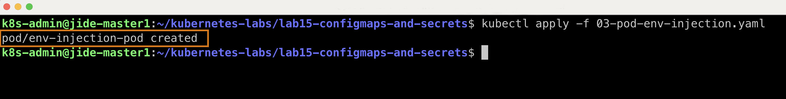

Verified the Pod reached the Running state.

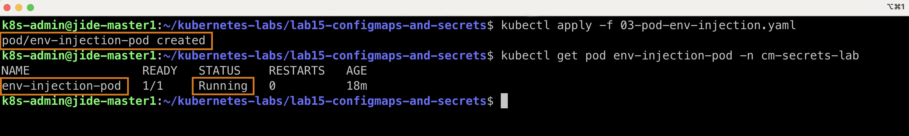

Entered the running container.

```bash
kubectl exec -it env-injection-pod -n cm-secrets-lab -- sh
```

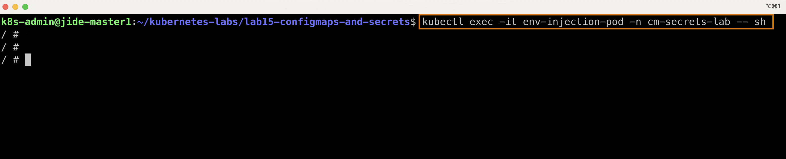

Verified that ConfigMap values were injected successfully.

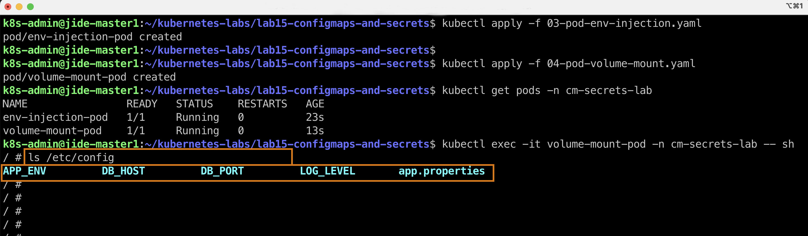

Verified the LOG_LEVEL value.

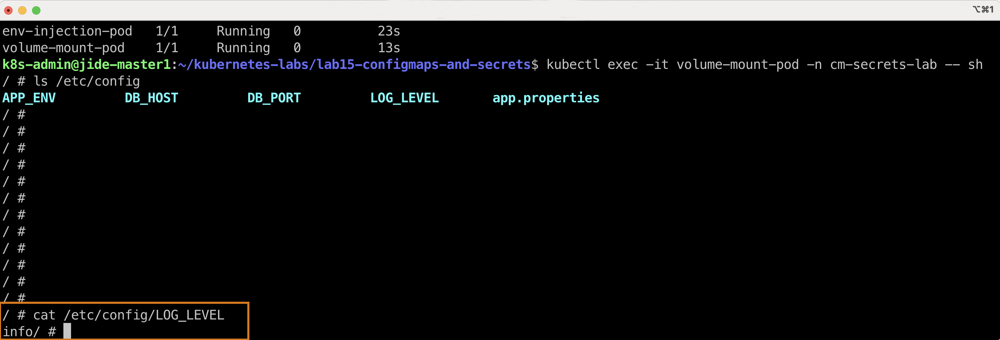

---

# Step 5 — Volume Mounts

Created a Pod that mounts ConfigMaps and Secrets as files.

```bash
kubectl apply -f 04-pod-volume-mount.yaml
```

Verified the Pod reached the Running state.

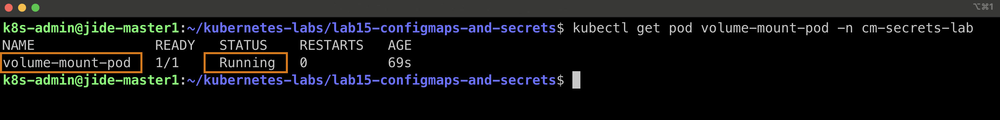

Verified the mounted **app.properties** file.

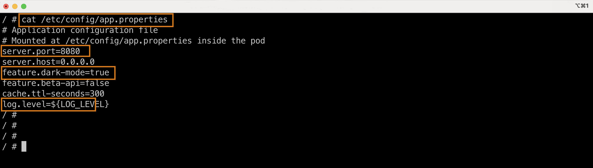

Verified mounted Secret files.

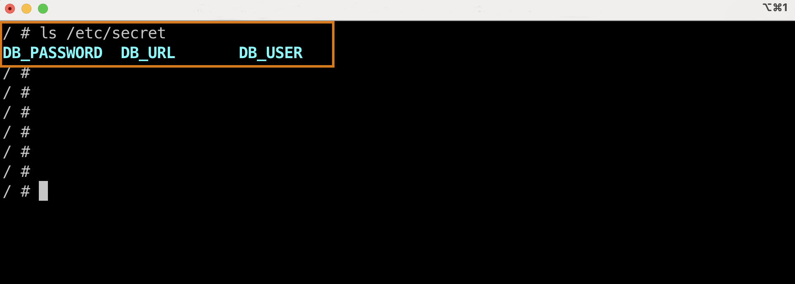

Verified Secret volume symbolic links and permissions.

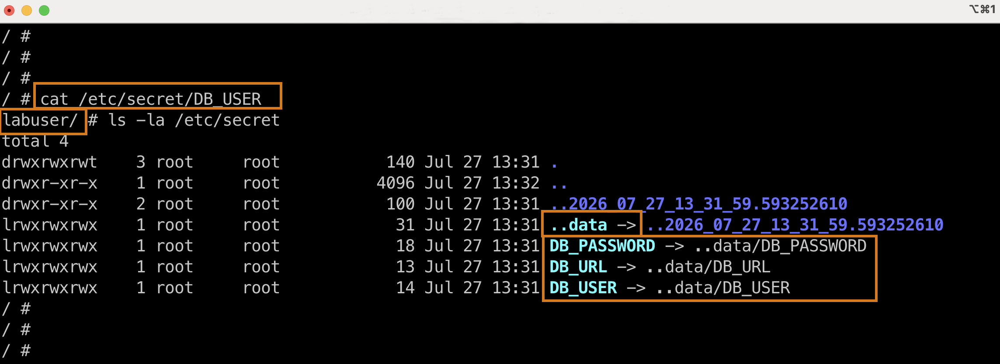

---

# Step 6 — Downward API

Verified Pod metadata exposed through the Downward API.

Checked:

- Pod name
- Namespace
- Labels
- Memory limit

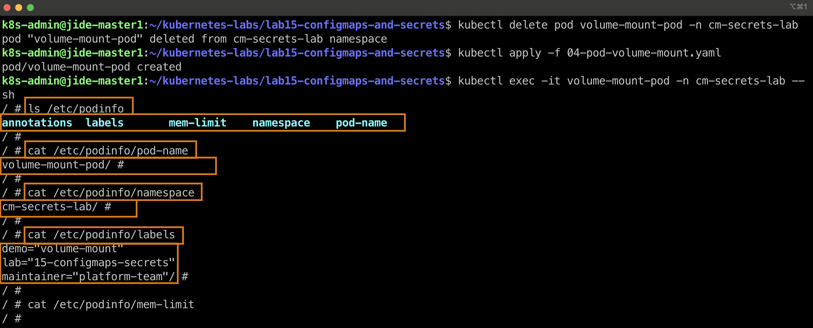

---

# Step 7 — Exit the Pod

Exited the running container after completing verification.

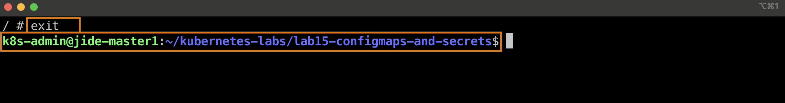

---

# Key Concepts Learned

## ConfigMaps

- Store non-sensitive configuration
- Can be consumed as environment variables
- Can also be mounted as files

## Secrets

- Store sensitive information
- Kubernetes stores them Base64 encoded
- Mounted files are automatically decoded inside the Pod

## Downward API

Allows applications running inside a Pod to discover:

- Pod name
- Namespace
- Labels
- Resource limits

without hardcoding those values.

---

# Files Included

- 01-configmap.yaml
- 02-secret.yaml
- 03-pod-env-injection.yaml
- 04-pod-volume-mount.yaml

---

# Cleanup

```bash
kubectl delete namespace cm-secrets-lab
```

---

# Skills Demonstrated

- Kubernetes ConfigMaps
- Kubernetes Secrets
- Environment Variable Injection
- Volume Mounts
- Secret Management
- Downward API
- Pod Metadata
- kubectl
- YAML

# Outcome

By completing this lab, I successfully:

- Created and managed Kubernetes ConfigMaps for application configuration.
- Created Secrets and verified how Kubernetes stores them using Base64 encoding.
- Injected ConfigMap and Secret values into Pods as environment variables.
- Mounted ConfigMaps and Secrets as files inside running Pods.
- Used the Downward API to expose Pod metadata to applications.
- Verified the differences between environment variable injection and volume-mounted configuration.
- Gained practical experience managing application configuration using Kubernetes best practices.

# Outcome

By completing this lab, I successfully:

- Created and managed Kubernetes ConfigMaps for application configuration.
- Created Secrets and verified how Kubernetes stores them using Base64 encoding.
- Injected ConfigMap and Secret values into Pods as environment variables.
- Mounted ConfigMaps and Secrets as files inside running Pods.
- Used the Downward API to expose Pod metadata to applications.
- Verified the differences between environment variable injection and volume-mounted configuration.
- Gained practical experience managing application configuration using Kubernetes best practices.

# Created By

## Babajide Ajisafe

Cloud | DevOps | Kubernetes

GitHub:
https://github.com/bojide

LinkedIn:
https://linkedin.com/in/babajide-ajisafe

---

Passionate about designing, automating, and managing scalable cloud-native infrastructure using Kubernetes, Docker, Terraform, AWS, and modern DevOps practices.
