# Lab 16 — Kubernetes Pod Controllers

## Overview

This lab explores how Kubernetes controllers manage Pods for different application workloads.

Rather than creating standalone Pods directly, Kubernetes commonly uses higher-level controllers to create, maintain, replace, scale, and schedule Pods automatically.

The lab demonstrates four important Kubernetes workload controllers:

- **Deployment** — manages stateless applications and supports rolling updates and rollbacks.
- **StatefulSet** — manages stateful workloads requiring stable Pod identities and predictable DNS names.
- **Job** — executes finite workloads that run until a specified number of successful completions is reached.
- **CronJob** — creates Jobs automatically according to a defined schedule.

The exercises demonstrate controller behavior through practical deployment, observation, updates, Pod deletion and recreation, DNS resolution, batch processing, scheduled execution, and CronJob suspension/resumption.

---

## Lab Objectives

By completing this lab, I was able to:

- Create and work within a dedicated Kubernetes namespace.
- Deploy applications using a Deployment controller.
- Examine the Deployment → ReplicaSet → Pod ownership hierarchy.
- Perform a rolling update.
- Observe multiple ReplicaSets during an application update.
- Roll back a Deployment to a previous revision.
- Deploy a StatefulSet with stable Pod identities.
- Understand the purpose of a Headless Service.
- Verify StatefulSet DNS resolution.
- Delete a StatefulSet Pod and observe identity preservation after recreation.
- Run parallel batch workloads using a Kubernetes Job.
- Verify successful Job completions.
- Observe Job Pods distributed across cluster nodes.
- Inspect execution logs from Job Pods.
- Create and validate a Kubernetes CronJob.
- Observe automatically created Jobs.
- Verify recurring CronJob execution through logs.
- Suspend and resume a CronJob.

---

## Lab Environment

The lab was performed on a multi-node Kubernetes cluster.

The following Kubernetes resources were used:

| Resource | Purpose |
|---|---|
| Namespace | Isolates Lab 16 resources |
| Deployment | Manages stateless replicated Pods |
| ReplicaSet | Maintains the desired number of Deployment Pods |
| StatefulSet | Manages Pods requiring stable identities |
| Headless Service | Provides direct DNS identities for StatefulSet Pods |
| Job | Runs finite batch workloads |
| CronJob | Runs Jobs according to a schedule |

The lab namespace used throughout the exercises was:

```text
controllers-lab
```

---

# 1. Creating the Lab Namespace

A dedicated namespace was created to isolate the resources used in this lab.

```bash
kubectl create namespace controllers-lab
```

The namespace provides a logical boundary for the Deployment, StatefulSet, Job, CronJob, Services, and Pods created during the exercises.

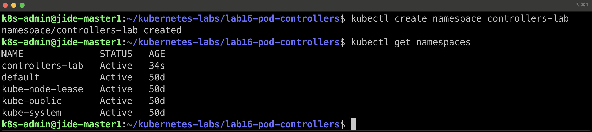

---

# 2. Deployment Controller

The first controller examined was a **Deployment**.

A Deployment is commonly used for stateless applications. It manages ReplicaSets, which in turn manage the application's Pods.

The Deployment manifest used in this lab is:

```text
01-deployment.yaml
```

The controller relationship can be represented as:

```text
Deployment
    │
    ▼
ReplicaSet
    │
    ▼
Pods
```

This ownership hierarchy allows Kubernetes to continuously maintain the desired application state.

---

## 2.1 Deployment Rollout

After applying the Deployment manifest, Kubernetes created the required resources and began the rollout process.

The rollout status was inspected to verify that the Deployment completed successfully.

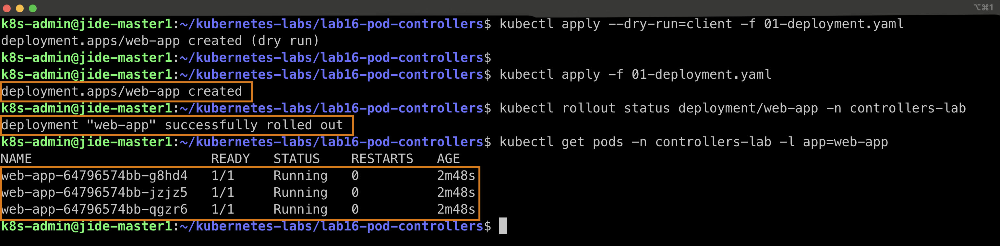

This demonstrates the Deployment controller ensuring that the desired number of application replicas becomes available.

---

## 2.2 Deployment Ownership Chain

The resources created by the Deployment were inspected to observe the controller ownership hierarchy.

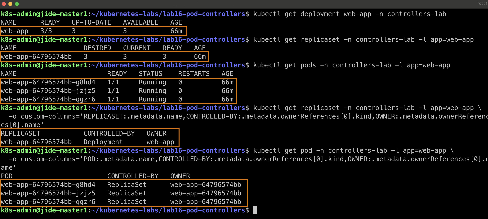

The relationship observed was:

```text
Deployment
    │
    └── ReplicaSet
            │
            ├── Pod
            ├── Pod
            └── Pod
```

The Deployment does not directly manage individual Pods. Instead, it manages a ReplicaSet, and the ReplicaSet maintains the required Pods.

This illustrates Kubernetes' declarative controller model.

---

# 3. Rolling Update

One of the major capabilities provided by Deployments is the ability to update applications gradually without replacing every running Pod simultaneously.

During a rolling update, Kubernetes creates a new ReplicaSet and gradually shifts the workload from the old ReplicaSet to the new one.

Conceptually:

```text
Old ReplicaSet
    │
    ├── Pod
    ├── Pod
    └── Pod

        ↓ Rolling Update

New ReplicaSet
    │
    ├── Pod
    ├── Pod
    └── Pod
```

---

## 3.1 Rolling Update in Progress

The Deployment image was updated and the rollout was observed while Kubernetes replaced the existing Pods.

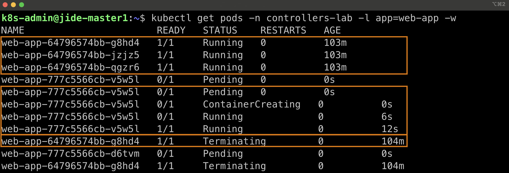

The output demonstrates Kubernetes progressively transitioning the application to the updated version.

---

## 3.2 ReplicaSets During the Rolling Update

The ReplicaSets were inspected during the update.

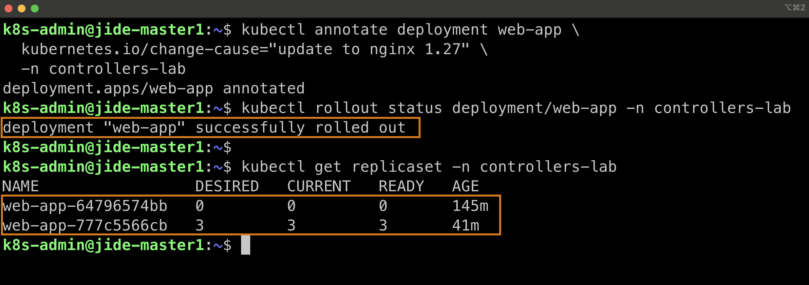

The presence of multiple ReplicaSets demonstrates how Kubernetes preserves Deployment revisions.

The older ReplicaSet can remain with zero active replicas while the newer ReplicaSet manages the current application Pods.

This revision history makes Deployment rollback possible.

---

# 4. Deployment Rollback

Kubernetes Deployments maintain rollout history, allowing an application to return to a previous revision if an update causes problems.

A rollback was performed and the Deployment returned to the previous working revision.

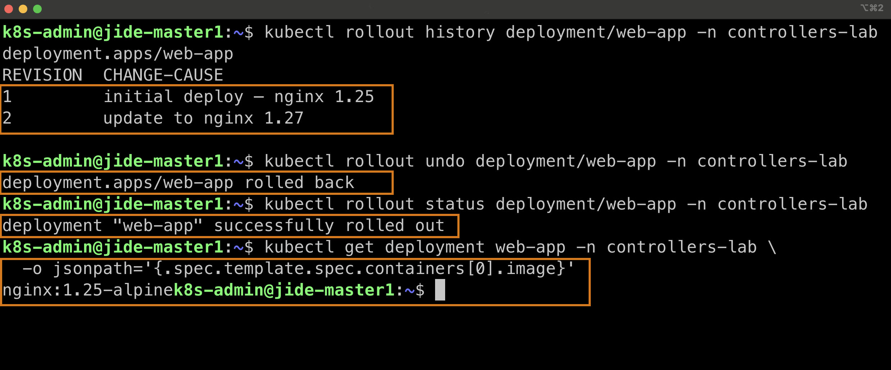

This capability is particularly valuable in production environments because a problematic application release can be reversed without manually rebuilding the previous Pods.

---

# 5. StatefulSet Controller

The next controller examined was a **StatefulSet**.

The StatefulSet manifest used in the lab is:

```text
02-statefulset.yaml
```

Unlike Deployment Pods, StatefulSet Pods maintain predictable identities.

For example:

```text
db-0
db-1
db-2
```

These names are deterministic rather than randomly generated.

StatefulSets are useful for applications such as:

- Databases
- Distributed storage systems
- Clustered applications
- Applications requiring predictable network identities

---

## 5.1 Stable Pod Identities

The StatefulSet created three Pods with predictable ordinal names.

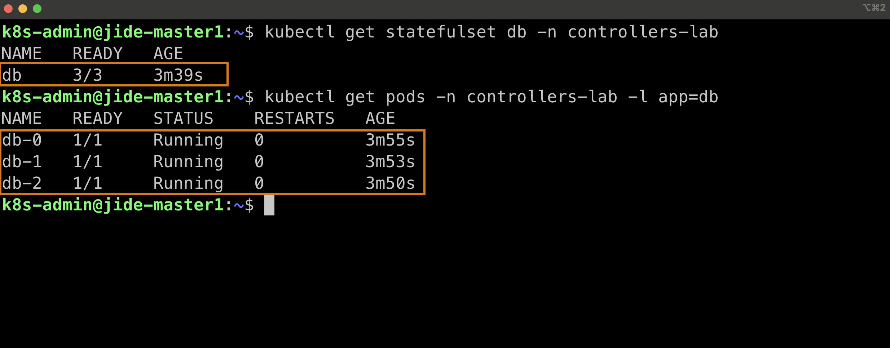

The Pod names demonstrate the StatefulSet naming pattern:

```text
<StatefulSet-name>-<ordinal>
```

Therefore:

```text
db-0
db-1
db-2
```

represent three distinct members of the StatefulSet.

---

# 6. StatefulSet DNS Resolution

A StatefulSet is commonly paired with a **Headless Service**.

The Headless Service used in this lab was:

```text
db-headless
```

Unlike a normal ClusterIP Service, a Headless Service uses:

```text
clusterIP: None
```

This allows DNS to resolve directly to individual StatefulSet Pods instead of routing through a single virtual Service IP.

A StatefulSet Pod can therefore receive a predictable DNS identity such as:

```text
db-1.db-headless.controllers-lab.svc.cluster.local
```

---

## 6.1 DNS Lookup

DNS resolution between StatefulSet Pods was tested using `nslookup`.

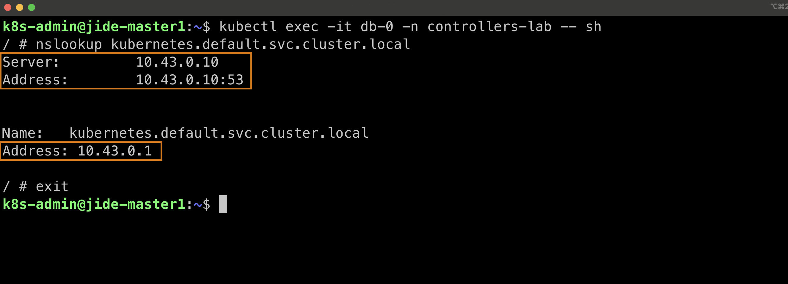

A more focused DNS lookup demonstrates the complete DNS query and its resolved Pod address.

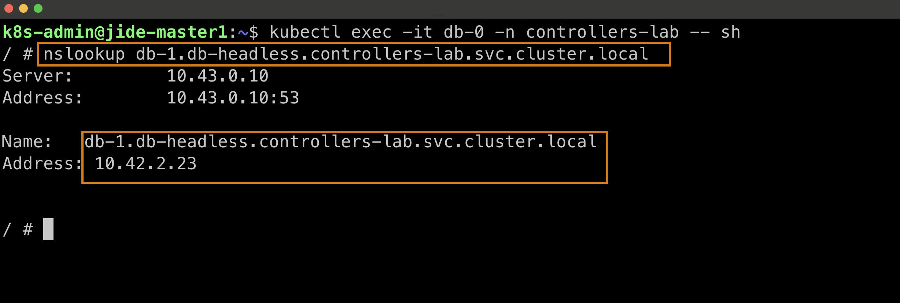

The successful lookup demonstrates that Kubernetes DNS can resolve the stable StatefulSet Pod identity through the Headless Service.

The pattern is:

```text
<pod-name>.<headless-service>.<namespace>.svc.cluster.local
```

For this lab:

```text
db-1.db-headless.controllers-lab.svc.cluster.local
```

---

# 7. StatefulSet Pod Recreation

An important difference between a Deployment and StatefulSet is what happens to Pod identity after failure or deletion.

A StatefulSet Pod was deliberately deleted.

Kubernetes detected that the actual state no longer matched the desired state and created a replacement.

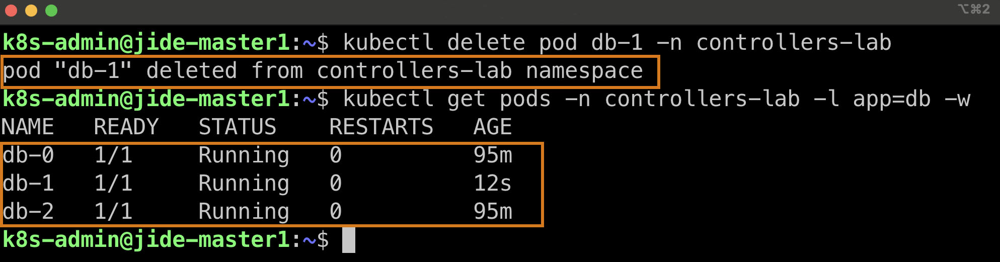

Although the Pod itself was recreated, its logical identity remained associated with the same ordinal.

For example:

```text
Before deletion:
db-1

After recreation:
db-1
```

The Pod may receive a different IP address after recreation, but the stable StatefulSet identity remains.

This is a fundamental characteristic of StatefulSets.

---

# 8. Kubernetes Job Controller

The third controller examined was a **Job**.

The Job manifest used in the lab is:

```text
03-job.yaml
```

Unlike Deployments, Jobs are designed for workloads that are expected to **finish**.

Typical Job use cases include:

- Batch processing
- Database migrations
- Data transformations
- Report generation
- Maintenance operations
- One-time automation tasks

The Job controller monitors successful Pod completions rather than attempting to keep the Pods running indefinitely.

---

## 8.1 Job Pods Completing

The Job created Pods to execute the batch workload.

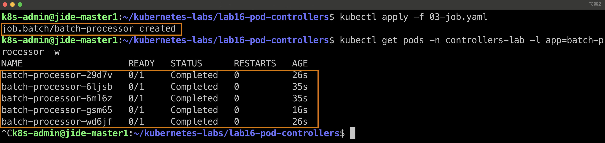

A completed Pod is not considered a failure in this situation.

For a Job:

```text
Running → Completed
```

is the expected lifecycle when the workload finishes successfully.

---

## 8.2 Job Completion Target

The Job was configured to require multiple successful executions.

The completion status reached:

```text
5/5
```

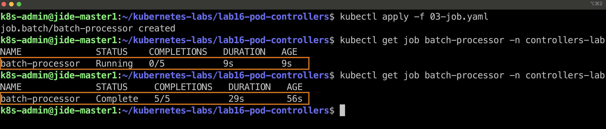

This demonstrates the difference between **completions** and **parallelism**.

```text
completions
    = total number of successful Pod executions required

parallelism
    = maximum number of those Pods allowed to execute simultaneously
```

The Job controller continues creating or managing Pods until the requested number of successful completions is achieved.

---

## 8.3 Job Pod Placement Across Nodes

The Job Pods were inspected using wide output to observe where Kubernetes scheduled them.

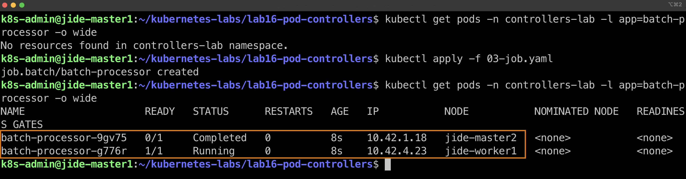

This demonstrates that Pods belonging to the same Job do not necessarily execute on the same Kubernetes node.

The Kubernetes scheduler determines Pod placement based on available cluster resources and scheduling constraints.

---

## 8.4 Job Execution Logs

Logs were collected from the Job Pods to verify that the batch workload executed successfully.

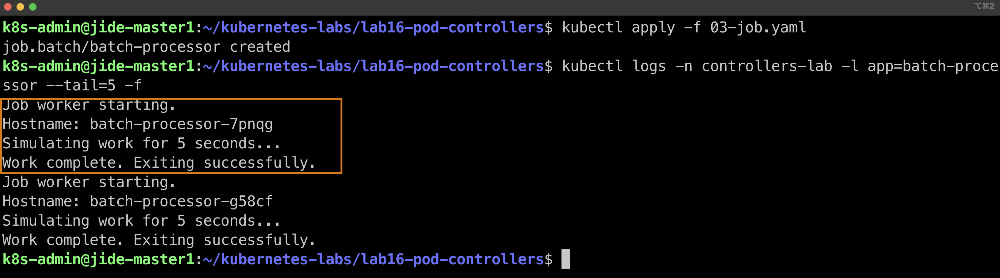

The logs confirmed that the worker Pods started, performed their simulated work, and exited successfully.

This illustrates the expected lifecycle:

```text
Job
 │
 ├── Creates Pod
 │
 ├── Pod executes workload
 │
 ├── Process exits successfully
 │
 └── Job records successful completion
```

---

# 9. Additional StatefulSet Verification

Before proceeding to the scheduled workload portion of the lab, the StatefulSet resources were inspected again.

---

## 9.1 StatefulSet Pods Running

The StatefulSet showed all three replicas available:

```text
READY
3/3
```

The individual Pods were also running with stable identities:

```text
db-0
db-1
db-2
```

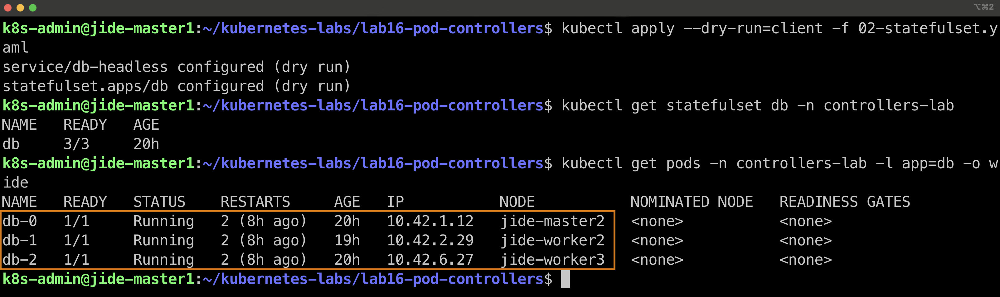

This confirms that the StatefulSet controller was maintaining the requested number of replicas.

---

## 9.2 Headless Service Verification

The Headless Service was inspected.

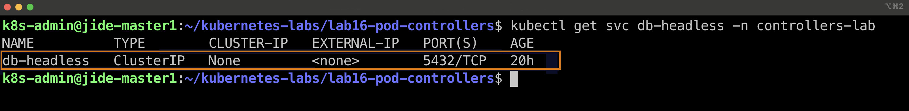

The important value was:

```text
CLUSTER-IP
None
```

This confirms that `db-headless` is a Headless Service.

Rather than providing one virtual ClusterIP, Kubernetes DNS can expose the individual Pod identities associated with the StatefulSet.

---

## 9.3 Stable DNS Resolution Result

DNS resolution was verified directly from within a StatefulSet Pod.

The lookup returned the expected DNS identity and corresponding Pod IP address.

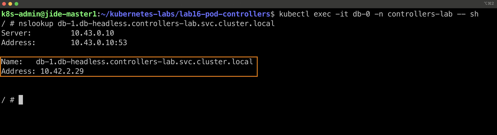

This verifies the relationship between:

```text
StatefulSet Pod
      +
Headless Service
      +
Kubernetes DNS
      │
      ▼
Stable Pod DNS Identity
```

Even if a StatefulSet Pod is recreated and receives a different Pod IP, its predictable DNS identity remains available through the StatefulSet and Headless Service design.

---

# 10. Kubernetes CronJob Controller

The final controller examined was a **CronJob**.

The CronJob manifest used in this lab is:

```text
04-cronjob.yaml
```

A CronJob creates Kubernetes Jobs automatically according to a schedule.

The relationship is:

```text
CronJob
   │
   ▼
 Job
   │
   ▼
 Pod
   │
   ▼
Workload Executes
```

This is different from a standard Job because the CronJob provides the scheduling layer.

---

## 10.1 CronJob Schedule

The CronJob was configured with:

```yaml
schedule: "*/1 * * * *"
```

This means:

```text
Run every minute
```

The CronJob also used:

```yaml
concurrencyPolicy: Forbid
```

which prevents a new Job from starting if the previous scheduled Job is still running.

The manifest additionally defined limits for successful and failed Job history.

---

## 10.2 CronJob Schedule Verification

After applying the CronJob manifest, its schedule and status were inspected.

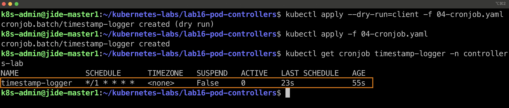

The output confirmed:

```text
SCHEDULE
*/1 * * * *

SUSPEND
False
```

This showed that the CronJob was active and configured to run once every minute.

---

# 11. CronJob Creates Jobs Automatically

After waiting for multiple schedule intervals, the Jobs created by the CronJob were inspected.

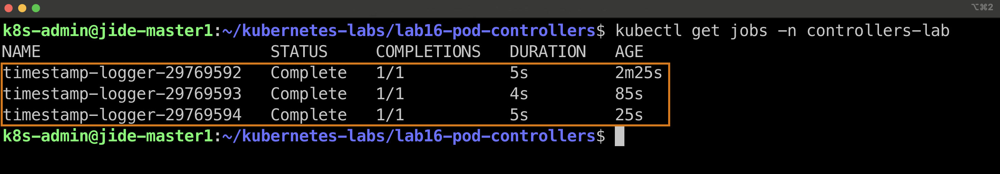

Multiple Jobs appeared with names based on the parent CronJob:

```text
timestamp-logger-<generated-value>
```

Each Job reached:

```text
STATUS: Complete
COMPLETIONS: 1/1
```

This demonstrates the controller hierarchy:

```text
timestamp-logger             CronJob
       │
       ├── timestamp-logger-xxxxx    Job
       │             │
       │             └── Pod
       │
       ├── timestamp-logger-yyyyy    Job
       │             │
       │             └── Pod
       │
       └── timestamp-logger-zzzzz    Job
                     │
                     └── Pod
```

The CronJob itself does not directly execute the container.

It creates Jobs, and those Jobs create Pods.

---

# 12. CronJob Execution Logs

Logs from the scheduled workload were inspected.

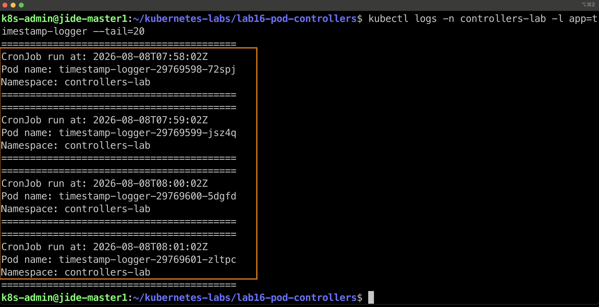

The output showed separate executions occurring approximately once per minute.

Each execution recorded information including:

```text
CronJob run at: <timestamp>
Pod name: <generated-pod-name>
Namespace: controllers-lab
```

The changing timestamps and Pod names demonstrate that these were separate scheduled executions rather than repeated output from one long-running Pod.

The lifecycle is therefore:

```text
Schedule reached
      │
      ▼
CronJob creates Job
      │
      ▼
Job creates Pod
      │
      ▼
Pod executes command
      │
      ▼
Pod completes
      │
      ▼
Next schedule creates another Job
```

---

# 13. Suspending the CronJob

CronJobs can be temporarily prevented from creating new Jobs without deleting the CronJob resource.

The CronJob was patched with:

```bash
kubectl patch cronjob timestamp-logger \
  -n controllers-lab \
  -p '{"spec":{"suspend":true}}'
```

The CronJob status was then verified.

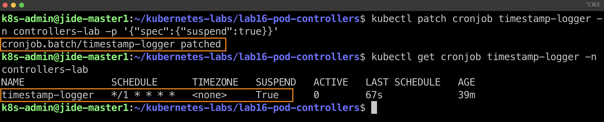

The important change was:

```text
SUSPEND
True
```

While suspended, the CronJob remains in Kubernetes, but new scheduled Jobs are not created.

This can be useful during:

- Maintenance
- Troubleshooting
- Application changes
- Temporary workload pauses

---

# 14. Resuming the CronJob

The CronJob was resumed by changing `suspend` back to `false`.

```bash
kubectl patch cronjob timestamp-logger \
  -n controllers-lab \
  -p '{"spec":{"suspend":false}}'
```

The CronJob status was checked again.

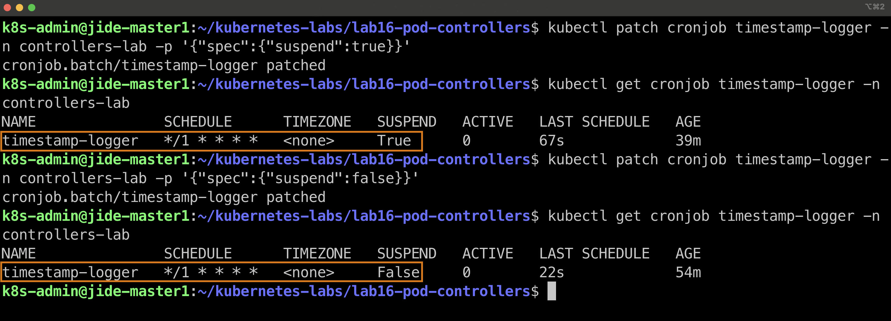

The output confirmed:

```text
SUSPEND
False
```

This demonstrates that a CronJob can be paused and resumed without deleting and recreating the resource.

---

# 15. Comparing the Controllers

Although Deployment, StatefulSet, Job, and CronJob all ultimately result in Pods being created, they solve different workload-management problems.

| Controller | Primary Purpose | Pod Behavior | Typical Workload |
|---|---|---|---|
| Deployment | Maintain stateless applications | Pods are interchangeable | Web/API applications |
| StatefulSet | Maintain stateful applications | Pods have stable identities | Databases and clustered systems |
| Job | Complete finite work | Pods run until successful completion | Batch processing |
| CronJob | Execute Jobs on a schedule | New Jobs/Pods are periodically created | Backups and scheduled automation |

A useful mental model is:

```text
Deployment
    │
    ▼
ReplicaSet
    │
    ▼
Long-running interchangeable Pods


StatefulSet
    │
    ▼
Long-running Pods with stable identities


Job
    │
    ▼
Pods that execute work and finish


CronJob
    │
    ▼
Scheduled Job
    │
    ▼
Pod that executes work and finishes
```

---

# 16. Key Concepts Demonstrated

## Declarative State

Kubernetes controllers continuously compare:

```text
Desired State
      │
      ▼
Actual State
```

When the two differ, the controller takes action to reconcile them.

For example, deleting a managed Pod does not necessarily reduce the application permanently because the appropriate controller can create a replacement.

---

## Controller Ownership

Kubernetes resources frequently form ownership relationships.

Examples from this lab include:

```text
Deployment
   └── ReplicaSet
          └── Pod
```

and:

```text
CronJob
   └── Job
        └── Pod
```

Understanding these relationships is important when troubleshooting Kubernetes workloads.

---

## Stable Identity vs Interchangeable Pods

Deployment Pods are generally treated as interchangeable replicas.

StatefulSet Pods are different.

```text
Deployment:

web-7d9c8f-abc12
web-7d9c8f-def34
web-7d9c8f-ghi56

        vs.

StatefulSet:

db-0
db-1
db-2
```

StatefulSet ordinals provide predictable identities that are valuable for stateful and clustered applications.

---

## Headless Services

A Headless Service does not provide a traditional virtual Service IP.

```yaml
clusterIP: None
```

Instead, it enables DNS-based discovery of individual Pods.

In this lab:

```text
db-1.db-headless.controllers-lab.svc.cluster.local
```

resolved directly to the corresponding StatefulSet Pod.

---

## Jobs vs Long-Running Workloads

A completed container is normally undesirable for a Deployment because Deployments are expected to maintain running application replicas.

For a Job, successful termination is the goal.

```text
Deployment Pod:
Running → should remain Running

Job Pod:
Running → Completed ✓
```

---

## Scheduled Workloads

CronJobs add time-based scheduling to Kubernetes batch workloads.

```text
Cron Schedule
     │
     ▼
CronJob
     │
     ▼
Job
     │
     ▼
Pod
     │
     ▼
Command executes
```

This makes CronJobs useful for recurring operational tasks.

---

# 17. Kubernetes Manifests

The following manifests were created and used during Lab 16:

```text
01-deployment.yaml
02-statefulset.yaml
03-job.yaml
04-cronjob.yaml
```

Each manifest represents a different workload-management strategy.

```text
01-deployment.yaml
        │
        └── Stateless / continuously running workload

02-statefulset.yaml
        │
        └── Stateful workload with stable identities

03-job.yaml
        │
        └── Finite batch workload

04-cronjob.yaml
        │
        └── Recurring scheduled workload
```

---

# 18. Repository Structure

The final Lab 16 directory is organized as:

```text
lab16-pod-controllers/
│
├── 01-deployment.yaml
├── 02-statefulset.yaml
├── 03-job.yaml
├── 04-cronjob.yaml
├── README.md
│
└── screenshots-lab16/
    ├── lab16-01-namespace-created.jpg
    ├── lab16-02-deployment-rollout.jpg
    ├── lab16-03-deployment-ownership-chain.jpg
    ├── lab16-04-rolling-update-in-progress.jpg
    ├── lab16-05-rolling-update-replicasets.jpg
    ├── lab16-06-deployment-rollback.jpg
    ├── lab16-07-statefulset-stable-pod-identities.jpg
    ├── lab16-08-statefulset-dns-resolution.jpg
    ├── lab16-09-statefulset-dns-lookup.jpg
    ├── lab16-10-statefulset-pod-recreation.jpg
    ├── lab16-11-job-pods-completed.jpg
    ├── lab16-12-job-completion-5-of-5.jpg
    ├── lab16-13-job-pod-node-placement.jpg
    ├── lab16-14-job-pod-execution-logs.jpg
    ├── lab16-15-statefulset-pods-running.jpg
    ├── lab16-16-statefulset-headless-service.jpg
    ├── lab16-17-statefulset-dns-resolution-result.jpg
    ├── lab16-18-cronjob-schedule-verified.jpg
    ├── lab16-19-cronjob-jobs-created.jpg
    ├── lab16-20-cronjob-execution-logs.jpg
    ├── lab16-21-cronjob-suspended.jpg
    └── lab16-22-cronjob-resumed.jpg
```

---

# 19. Key Takeaways

This lab demonstrated that Kubernetes controllers provide different abstractions for managing different workload requirements.

The major lessons from the lab were:

1. **Deployments manage stateless application replicas** and provide rolling updates and rollbacks.

2. **ReplicaSets operate underneath Deployments** to maintain the required number of Pods.

3. **StatefulSets provide predictable Pod identities**, making them suitable for applications where identity and ordering matter.

4. **Headless Services enable stable DNS discovery** for individual StatefulSet Pods.

5. **Deleting a controller-managed Pod does not remove the desired workload permanently** because Kubernetes reconciles the actual state with the desired state.

6. **Jobs are designed to finish**, making `Completed` a successful state rather than a problem.

7. **Job completions and parallelism control batch execution behavior.**

8. **CronJobs schedule Jobs**, rather than directly running application containers.

9. **CronJob executions produce separate Jobs and Pods over time.**

10. **CronJobs can be suspended and resumed** without deleting the resource.

The central concept demonstrated throughout the lab is:

```text
You declare the desired state.

Kubernetes controllers continuously work
to make the actual state match it.
```

---

# 20. Cleanup

After completing and documenting the lab, all resources can be removed by deleting the dedicated namespace:

```bash
kubectl delete namespace controllers-lab
```

Because the resources were created inside the namespace, deleting the namespace removes the associated:

```text
Deployment
ReplicaSets
Pods
StatefulSet
Headless Service
Jobs
CronJob
```

The namespace can then be verified:

```bash
kubectl get namespace controllers-lab
```

Expected result:

```text
Error from server (NotFound): namespaces "controllers-lab" not found
```

---

## Conclusion

Lab 16 provided hands-on experience with four major Kubernetes workload controllers and demonstrated how Kubernetes selects different controller patterns based on application requirements.

The Deployment exercises demonstrated stateless workload management, ReplicaSet ownership, rolling updates, and rollback.

The StatefulSet exercises demonstrated stable Pod identities, Headless Services, DNS-based discovery, and Pod recreation while preserving logical identity.

The Job exercises demonstrated finite batch processing, successful completions, parallel Pod execution, node placement, and execution logs.

Finally, the CronJob exercises demonstrated scheduled Job creation, recurring execution, workload logging, and operational control through suspension and resumption.

Together, these exercises demonstrate an important Kubernetes principle:

> **Pods perform the work, but controllers manage the lifecycle.**

---

**Designed & Authored by Babajide Ajisafe © 2026**
