# Lab 17 — Kubernetes Network Policies

## Overview

This lab explores how Kubernetes `NetworkPolicy` resources control Pod-to-Pod communication using a **default-deny and explicitly-allow** security model.

A small multi-tier environment was deployed containing:

* A **frontend** workload
* Two **backend** replicas running nginx on TCP port `8080`
* A **backend ClusterIP Service**
* An **attacker** workload used to test unauthorized access

The lab began with unrestricted communication and progressively introduced NetworkPolicies to demonstrate how Kubernetes can isolate workloads and permit only specifically authorized traffic.

The final security posture allows:

* Frontend → Backend on TCP `8080`
* DNS egress on TCP/UDP `53`
* Backend access only from Pods labeled `role=frontend`

The attacker can resolve the backend Service through DNS but remains unable to connect to the backend application.

---

## Objectives

By completing this lab, I demonstrated how to:

* Deploy a multi-tier Kubernetes test environment
* Establish baseline Pod-to-Pod connectivity
* Apply a namespace-wide default-deny policy
* Distinguish between **Ingress** and **Egress**
* Use Pod labels in NetworkPolicy selectors
* Allow frontend → backend traffic on TCP port `8080`
* Control frontend egress separately from backend ingress
* Demonstrate the difference between direct Pod-IP connectivity and Service-name resolution
* Restore DNS access using TCP/UDP port `53`
* Verify that an unauthorized Pod remains blocked
* Inspect the active NetworkPolicy with `kubectl describe`
* Validate all manifests before committing the lab to source control

---

## Architecture

```text
                    netpol-lab Namespace

              ┌─────────────────────────┐
              │                         │
              │      FRONTEND POD       │
              │     role=frontend       │
              │                         │
              └────────────┬────────────┘
                           │
                           │ TCP 8080
                           │ ALLOWED
                           ▼
                 ┌───────────────────┐
                 │    backend-svc    │
                 │ ClusterIP Service │
                 │     :8080         │
                 └─────────┬─────────┘
                           │
                 ┌─────────┴─────────┐
                 ▼                   ▼
          ┌─────────────┐     ┌─────────────┐
          │ Backend Pod │     │ Backend Pod │
          │ app=backend │     │ app=backend │
          │ TCP 8080    │     │ TCP 8080    │
          └─────────────┘     └─────────────┘


              ┌─────────────────────────┐
              │      ATTACKER POD       │
              │      app=attacker       │
              └────────────┬────────────┘
                           │
                           X
                    Backend Access
                       BLOCKED


          DNS Egress TCP/UDP 53 → ALLOWED
```

---

## Lab Files

```text
lab17-network-policies/
├── 00-setup.yaml
├── 01-default-deny-all.yaml
├── 02-allow-frontend-to-backend.yaml
├── 03-allow-frontend-egress.yaml
├── 04-allow-egress-dns.yaml
└── README.md
```

### Manifest Purpose

| File                                | Purpose                                                                          |
| ----------------------------------- | -------------------------------------------------------------------------------- |
| `00-setup.yaml`                     | Creates the namespace, frontend, backend, backend Service, and attacker workload |
| `01-default-deny-all.yaml`          | Denies all ingress and egress traffic for Pods in the namespace                  |
| `02-allow-frontend-to-backend.yaml` | Allows frontend Pods to enter backend Pods on TCP `8080`                         |
| `03-allow-frontend-egress.yaml`     | Allows frontend Pods to send TCP `8080` traffic to backend Pods                  |
| `04-allow-egress-dns.yaml`          | Restores DNS traffic using TCP/UDP port `53`                                     |

---

## Step 1 — Deploy the Lab Environment

The environment was created using:

```bash
kubectl apply --dry-run=client -f 00-setup.yaml
kubectl apply -f 00-setup.yaml
```

The manifest created:

* Namespace `netpol-lab`
* Backend Deployment with two replicas
* Backend Service `backend-svc`
* Frontend Deployment
* Attacker Deployment

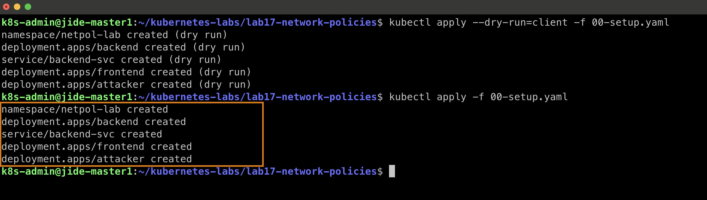

The workloads were then verified:

```bash
kubectl get pods -n netpol-lab -o wide
```

All four Pods became `Running`.

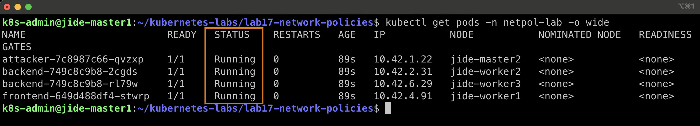

---

## Step 2 — Establish Baseline Connectivity

Before applying any NetworkPolicy, the namespace contained no network restrictions:

```bash
kubectl get networkpolicy -n netpol-lab
```

Expected result:

```text
No resources found in netpol-lab namespace.
```

### Frontend → Backend

The frontend Pod was identified:

```bash
FRONTEND=$(kubectl get pod -n netpol-lab -l app=frontend -o name | head -1)
```

Connectivity was tested:

```bash
kubectl exec -n netpol-lab $FRONTEND -- \
curl -s --max-time 5 http://backend-svc:8080
```

The nginx welcome page was returned successfully.

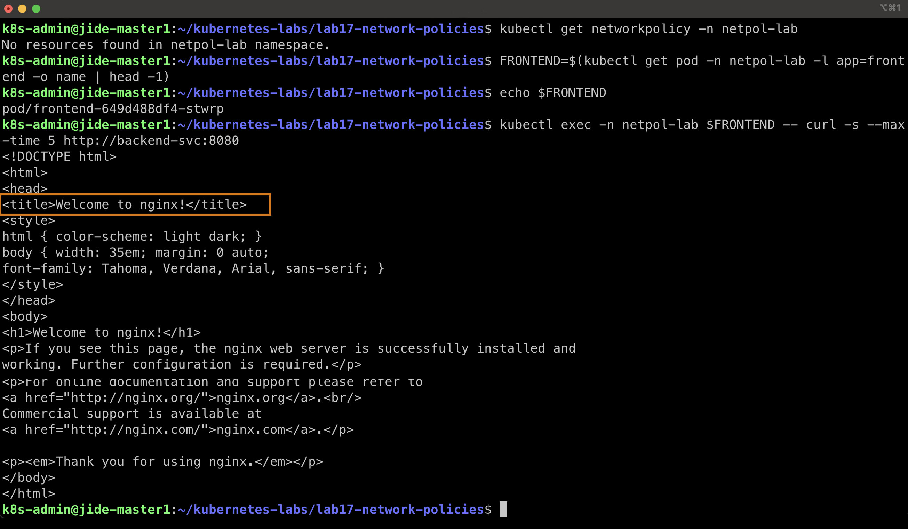

### Attacker → Backend

The attacker Pod was identified:

```bash
ATTACKER=$(kubectl get pod -n netpol-lab -l app=attacker -o name | head -1)
```

The attacker was also able to reach the backend:

```bash
kubectl exec -n netpol-lab $ATTACKER -- \
curl -s --max-time 5 http://backend-svc:8080
```

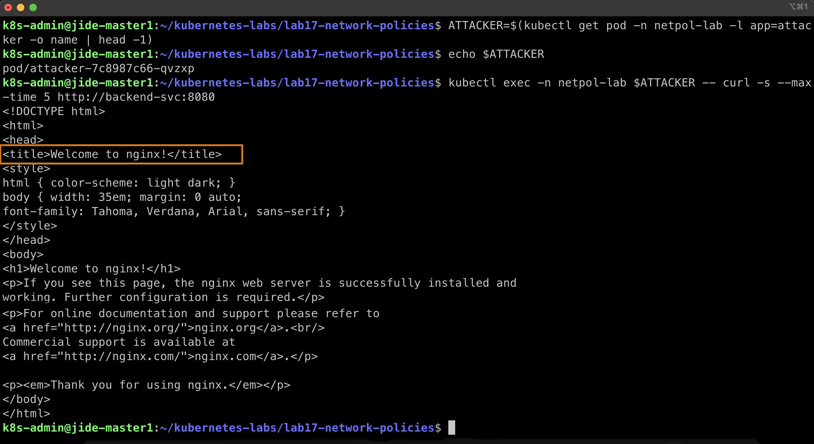

### Observation

Without a NetworkPolicy, both the trusted frontend and the untrusted attacker could communicate with the backend.

```text
Frontend ─────────► Backend   ALLOWED

Attacker ─────────► Backend   ALLOWED
```

The label `app=attacker` does not automatically create a security restriction. Labels only become meaningful when a NetworkPolicy uses them as selectors.

---

## Step 3 — Apply Default Deny

A namespace-wide default-deny policy was applied:

```bash
kubectl apply -f 01-default-deny-all.yaml
```

The policy uses:

```yaml
podSelector: {}

policyTypes:
  - Ingress
  - Egress
```

An empty `podSelector: {}` selects **every Pod in the namespace**.

Because no ingress or egress allow rules are provided, all traffic in both directions is denied.

```bash
kubectl get networkpolicy -n netpol-lab
```

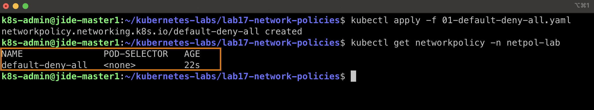

### Frontend Blocked

The frontend connectivity test was repeated:

```bash
kubectl exec -n netpol-lab $FRONTEND -- \
curl -sS --max-time 5 http://backend-svc:8080
```

The request timed out during DNS resolution:

```text
curl: (28) Resolving timed out...
```

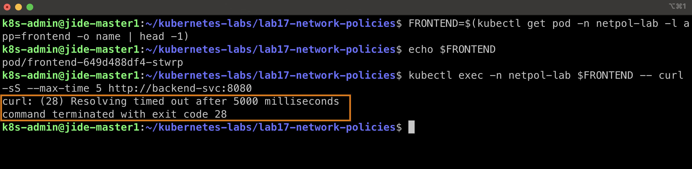

### Attacker Blocked

The attacker test was repeated and also failed.

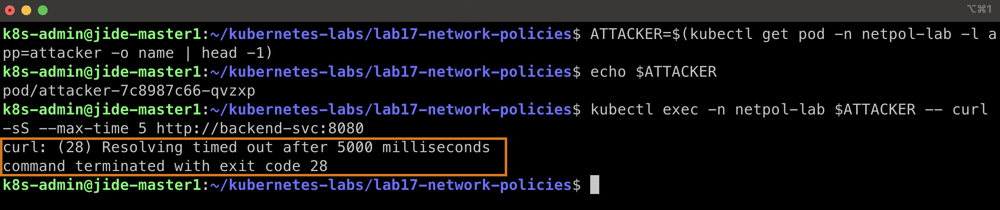

### Observation

The default-deny policy changed the communication model to:

```text
Frontend ─────X────► Backend

Attacker ─────X────► Backend
```

The workloads remained running; only their network permissions changed.

---

## Step 4 — Allow Frontend Ingress to the Backend

The next policy selectively allowed traffic into backend Pods:

```bash
kubectl apply -f 02-allow-frontend-to-backend.yaml
```

The policy selects:

```yaml
podSelector:
  matchLabels:
    app: backend
```

and permits traffic from:

```yaml
podSelector:
  matchLabels:
    role: frontend
```

on:

```yaml
protocol: TCP
port: 8080
```

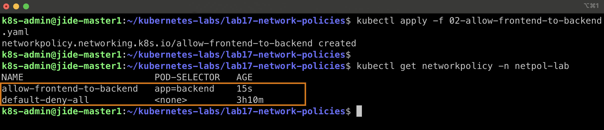

Conceptually:

```text
role=frontend
      │
      │ TCP 8080
      ▼
app=backend
```

However, frontend connectivity still failed.

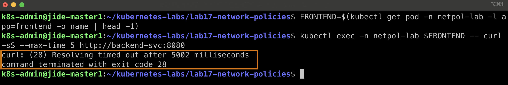

### Why?

The backend's **Ingress** door had been opened, but the frontend's **Egress** door was still closed by the default-deny policy.

This demonstrates an important NetworkPolicy principle:

> When both source egress and destination ingress are isolated, both sides of the connection must permit the traffic.

---

## Step 5 — Allow Frontend Egress to the Backend

An additional policy was created to allow frontend Pods to send traffic toward backend Pods on TCP `8080`:

```bash
kubectl apply -f 03-allow-frontend-egress.yaml
```

The policy selects the source:

```yaml
podSelector:
  matchLabels:
    role: frontend
```

and permits egress to:

```yaml
podSelector:
  matchLabels:
    app: backend
```

on TCP port `8080`.

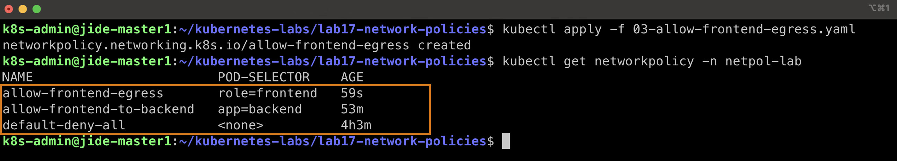

---

## Step 6 — Test Direct Pod-IP Connectivity

A backend Pod IP was retrieved:

```bash
BACKEND_IP=$(kubectl get pod -n netpol-lab \
-l app=backend \
-o jsonpath='{.items[0].status.podIP}')
```

The frontend then connected directly:

```bash
kubectl exec -n netpol-lab $FRONTEND -- \
curl -sS --max-time 5 http://$BACKEND_IP:8080
```

The request succeeded.

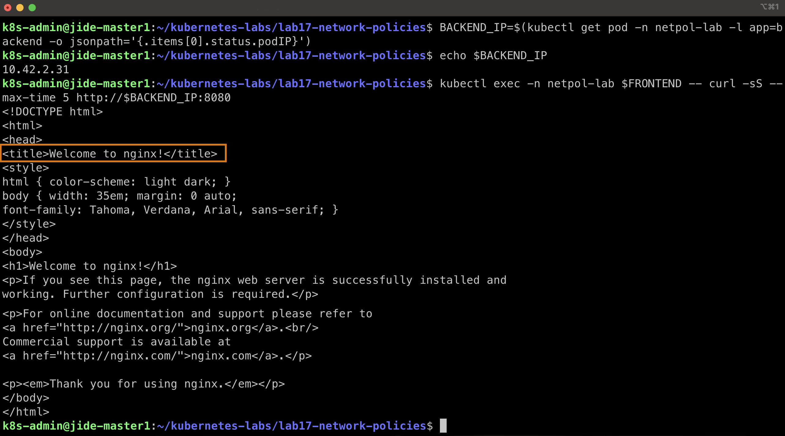

This proved that:

```text
Frontend Egress TCP 8080  → ALLOWED
Backend Ingress TCP 8080   → ALLOWED
```

The application path itself was working.

---

## Step 7 — Demonstrate DNS Is Still Blocked

The same frontend Pod was tested using the Service name:

```bash
kubectl exec -n netpol-lab $FRONTEND -- \
curl -sS --max-time 5 http://backend-svc:8080
```

The request failed:

```text
curl: (28) Resolving timed out...
```

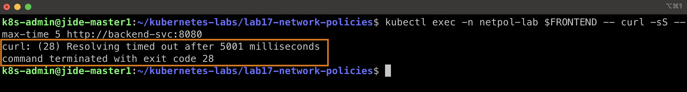

### Key Observation

```text
Backend Pod IP :8080   → SUCCESS
backend-svc:8080       → FAILURE
```

The application network path was permitted, but DNS resolution was still blocked.

This demonstrated that application traffic and DNS traffic are separate network requirements.

---

## Step 8 — Restore DNS Egress

DNS egress was restored using:

```bash
kubectl apply -f 04-allow-egress-dns.yaml
```

The policy permits:

```text
UDP 53
TCP 53
```

while the default-deny policy remains active.

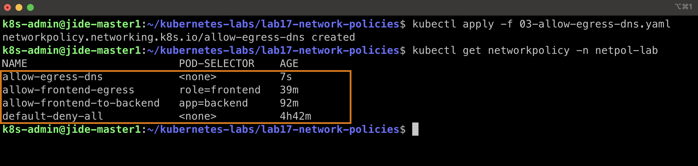

The frontend then retried:

```bash
kubectl exec -n netpol-lab $FRONTEND -- \
curl -sS --max-time 5 http://backend-svc:8080
```

This time the nginx welcome page was returned.

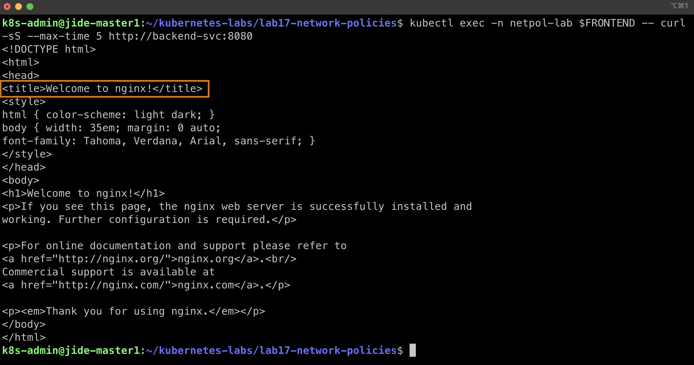

The final frontend path was therefore:

```text
Frontend
   │
   ├── DNS TCP/UDP 53        ALLOWED
   │
   └── Backend TCP 8080      ALLOWED
                                │
                                ▼
                         Backend Ingress
                              ALLOWED
```

---

## Step 9 — Verify the Attacker Remains Blocked

DNS permission applies to all Pods in the namespace, so the attacker can now resolve the backend Service.

The attacker attempted:

```bash
kubectl exec -n netpol-lab $ATTACKER -- \
curl -sS --max-time 5 http://backend-svc:8080
```

The request failed:

```text
curl: (7) Failed to connect to backend-svc port 8080
```

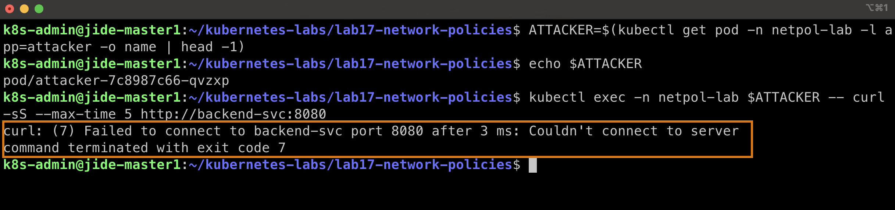

This is different from a DNS-resolution failure.

The attacker can discover the Service, but it is **not authorized to enter the backend**.

```text
Attacker → DNS                 ALLOWED

Attacker ─────X────► Backend   BLOCKED
```

This demonstrates the difference between **service discovery** and **service authorization**.

---

## Step 10 — Inspect the Backend NetworkPolicy

The active policy was inspected with:

```bash
kubectl describe networkpolicy allow-frontend-to-backend -n netpol-lab
```

Kubernetes reported:

```text
PodSelector: app=backend

Allowing ingress traffic:
  To Port: 8080/TCP

  From:
    PodSelector: role=frontend

Policy Types: Ingress
```

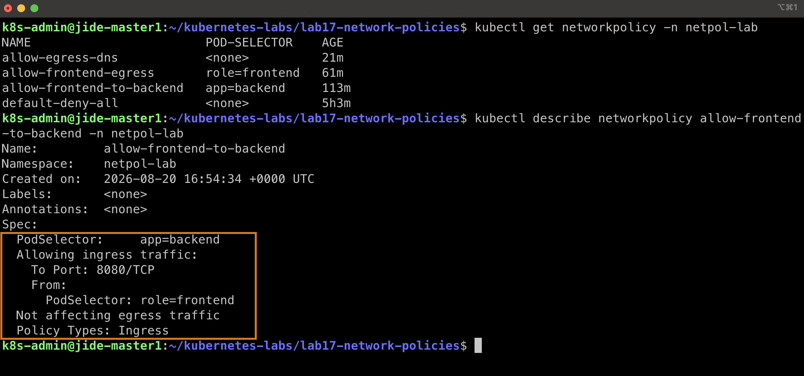

This confirms that Kubernetes interpreted the rule exactly as intended:

```text
Destination  → app=backend
Source       → role=frontend
Protocol     → TCP
Port         → 8080
Direction    → Ingress
```

---

## Step 11 — Final Manifest Validation

All manifests were validated together:

```bash
kubectl apply --dry-run=client \
-f 00-setup.yaml \
-f 01-default-deny-all.yaml \
-f 02-allow-frontend-to-backend.yaml \
-f 03-allow-frontend-egress.yaml \
-f 04-allow-egress-dns.yaml
```

All resources successfully passed validation.

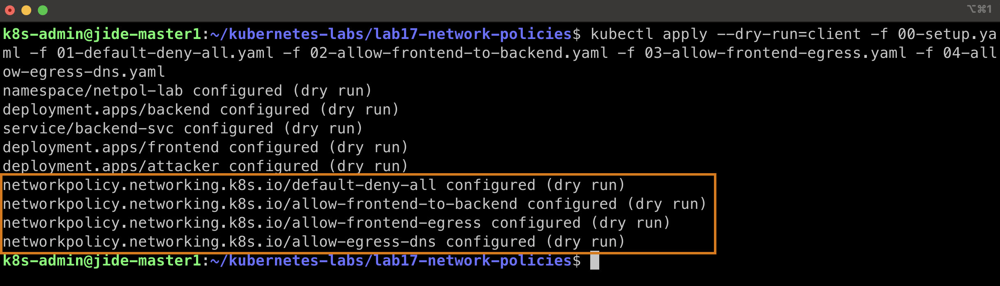

---

## Final Network Security State

```text
                       DNS
                    TCP/UDP 53
                        ▲
                        │
                   ALLOWED
                        │
                     Frontend
                        │
                        │ TCP 8080
                        │ ALLOWED
                        ▼
                  ┌───────────┐
                  │  Backend  │
                  │ app=backend
                  └───────────┘
                        ▲
                        │
                        X
                     BLOCKED
                        │
                     Attacker
```

---

## Key Takeaways

### 1. Kubernetes networking is open until workloads become isolated

Before NetworkPolicies were applied, both frontend and attacker traffic reached the backend.

### 2. Default deny establishes a zero-trust starting point

Instead of deciding what to block, the model becomes:

> Deny everything first, then explicitly allow only what is required.

### 3. Ingress and Egress are independent

**Ingress** controls traffic entering a Pod.

**Egress** controls traffic leaving a Pod.

A useful memory aid:

```text
INgress = IN
Egress  = EXIT
```

### 4. Both sides may need permission

Opening backend ingress did not automatically permit frontend communication because frontend egress remained denied.

### 5. NetworkPolicies use labels

The backend policy did not depend on temporary Pod names.

It used stable workload identities:

```text
role=frontend
app=backend
```

### 6. Ports can be explicitly restricted

The trusted frontend received access only to TCP port `8080`.

### 7. DNS is network traffic too

A default egress deny can prevent Pods from resolving Kubernetes Service names.

DNS commonly requires:

```text
UDP 53
TCP 53
```

### 8. DNS access is not application access

The attacker eventually gained DNS resolution but still could not connect to the backend.

That distinction is important:

```text
Discovering a service ≠ authorization to access it
```

### 9. NetworkPolicy does not stop the workloads

The frontend, backend, and attacker Pods remained `Running` throughout the experiment.

NetworkPolicy changed **communication permissions**, not application lifecycle.

---

## Result

The lab successfully demonstrated a Kubernetes zero-trust networking model in which:

```text
Frontend → Backend :8080   ALLOWED

Frontend → DNS :53         ALLOWED

Attacker → DNS :53         ALLOWED

Attacker → Backend :8080   BLOCKED

Other unspecified traffic  DENIED BY DEFAULT
```

The final configuration implements **least-privilege network communication** while preserving the connectivity required by the trusted application tier.

---

## Cleanup

After the lab has been documented and pushed to GitHub, the complete environment can be removed with:

```bash
kubectl delete namespace netpol-lab
```

Verification:

```bash
kubectl get namespace netpol-lab
```

Expected:

```text
Error from server (NotFound): namespaces "netpol-lab" not found
```
---

# Created

## Babajide Ajisafe

Cloud | DevOps | Kubernetes

GitHub:
https://github.com/bojide

LinkedIn:
https://linkedin.com/in/babajide-ajisafe

---

