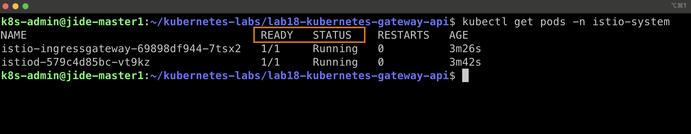
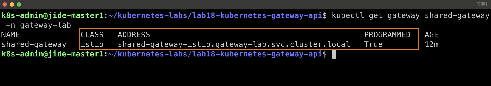
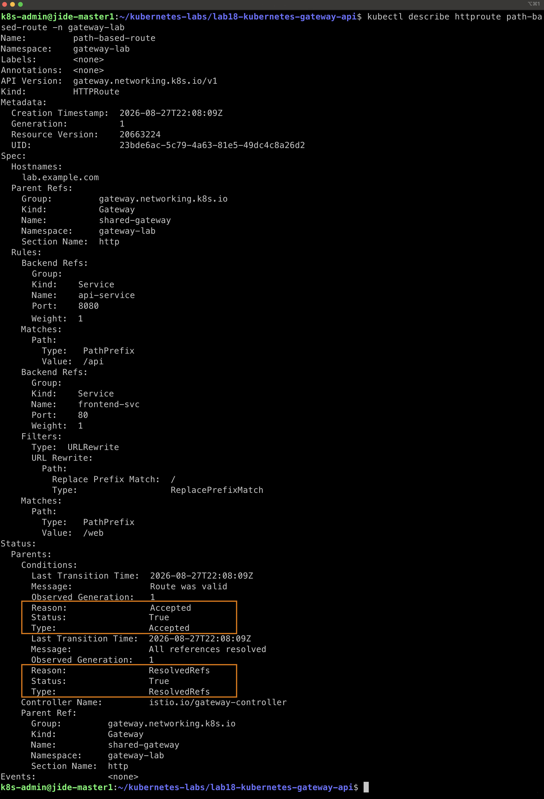
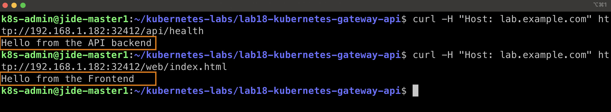
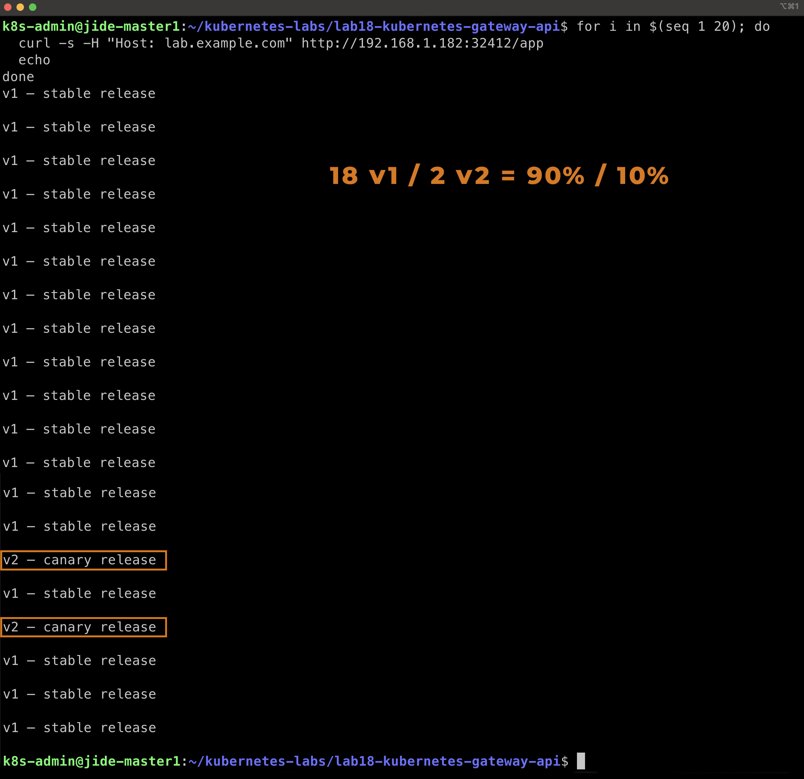
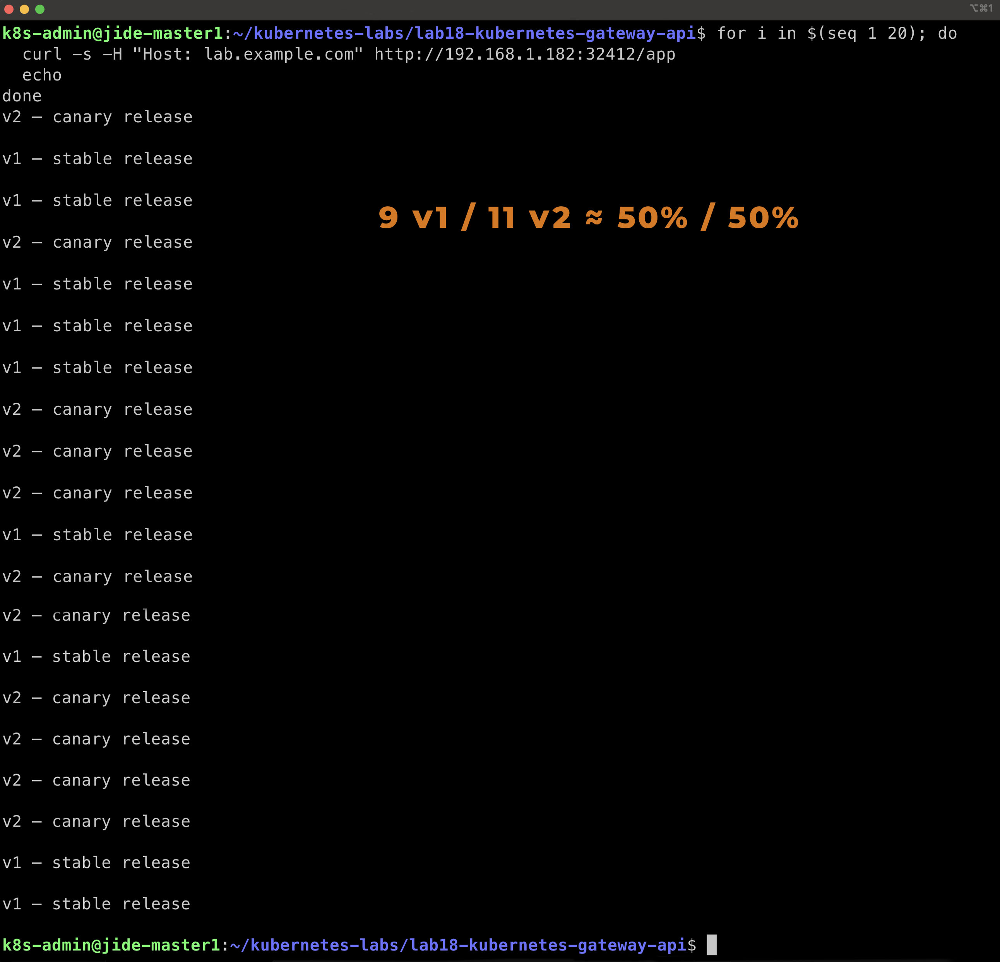
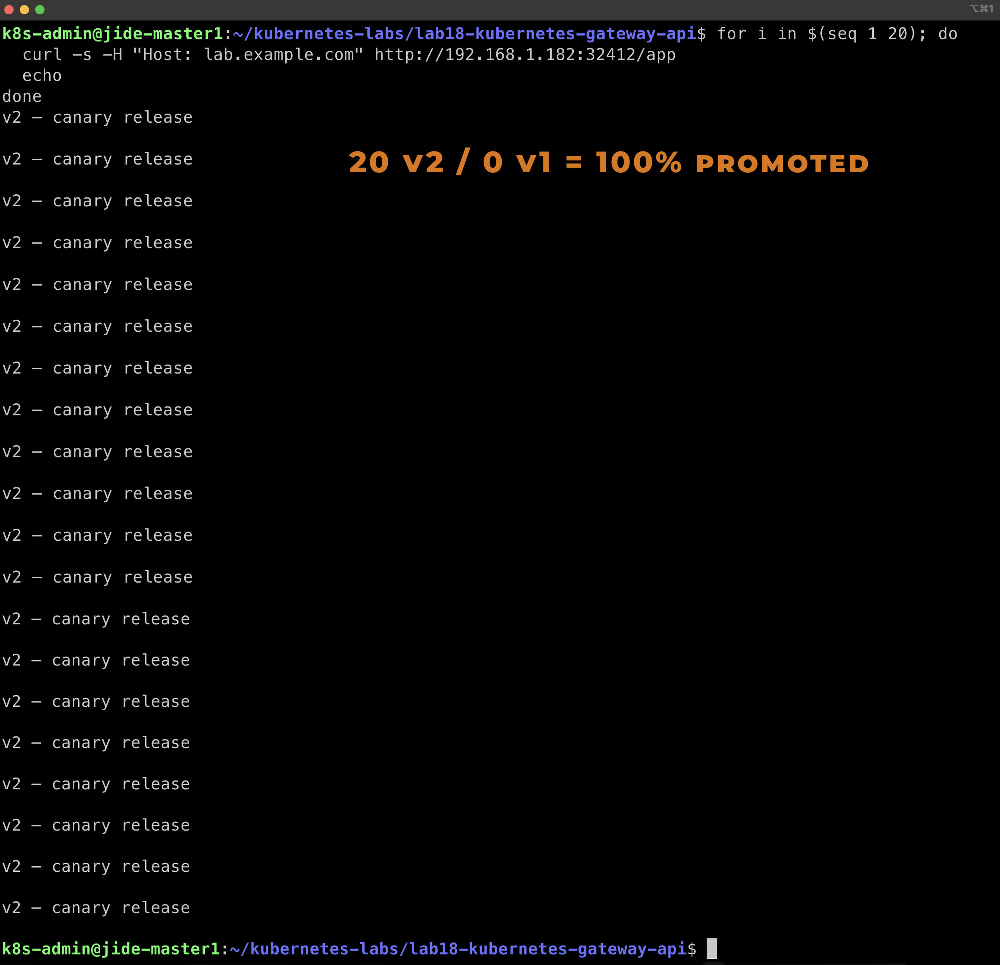
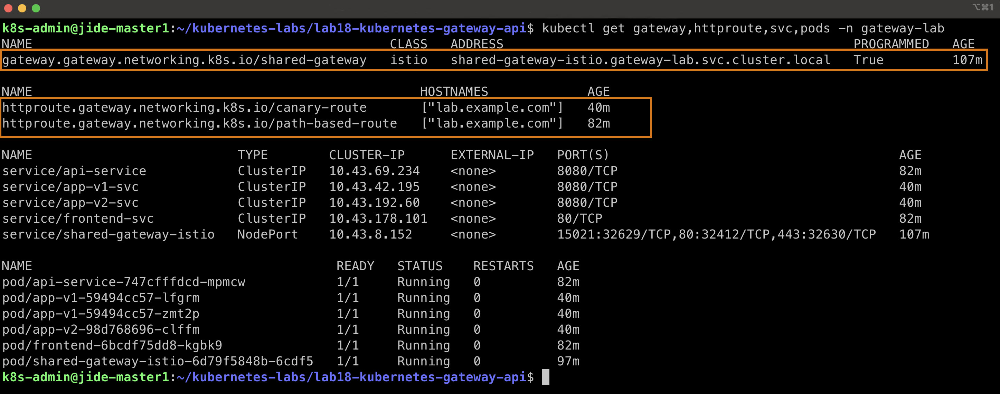

# Lab 18 — Kubernetes Gateway API with Istio

## Objective

This lab demonstrates how to use the **Kubernetes Gateway API with Istio** to manage application traffic inside a Kubernetes cluster.

The lab focuses on three major Gateway API capabilities:

- Creating an Istio-managed Kubernetes Gateway
- Implementing path-based routing with `HTTPRoute`
- Implementing weighted traffic splitting for a canary deployment

The canary deployment is progressively shifted through:

```text
90% v1 / 10% v2
        ↓
50% v1 / 50% v2
        ↓
0% v1 / 100% v2
```

This demonstrates how Gateway API can provide modern traffic-management capabilities while separating infrastructure configuration from application routing rules.

---

# 1. Lab Environment

The lab was performed on a local multi-node **K3s Kubernetes cluster**.

The main components used were:

```text
K3s Kubernetes Cluster
        │
        ▼
Istio
        │
        ▼
Kubernetes Gateway API
        │
        ▼
Gateway
        │
        ▼
HTTPRoute
        │
        ▼
Kubernetes Services
        │
        ▼
Application Pods
```

The dedicated namespace used for the lab was:

```text
gateway-lab
```

The application hostname used for HTTP routing was:

```text
lab.example.com
```

The GatewayClass used throughout the lab was:

```text
istio
```

---

# 2. Installing and Verifying Istio

Istio provides the Gateway API controller used in this lab.

Istio was installed using:

```bash
istioctl install --set profile=default -y
```

After installation, the Istio control-plane components were inspected in the `istio-system` namespace.



The important components were running successfully:

```text
istiod
istio-ingressgateway
```

Both Pods reported:

```text
READY
1/1

STATUS
Running
```

This confirmed that the Istio control plane and ingress gateway were operational before creating the Kubernetes Gateway.

---

# 3. Gateway API Architecture

Gateway API separates traffic infrastructure from application routing.

A simplified relationship is:

```text
GatewayClass
     │
     ▼
  Gateway
     │
     ▼
 HTTPRoute
     │
     ▼
  Service
     │
     ▼
    Pods
```

In this lab:

```text
GatewayClass
istio
     │
     ▼
Gateway
shared-gateway
     │
     ├── path-based-route
     │
     └── canary-route
              │
              ▼
        Backend Services
```

The `GatewayClass` identifies the controller responsible for implementing the Gateway.

The `Gateway` defines where traffic enters the environment.

The `HTTPRoute` defines how incoming HTTP traffic should be routed to Kubernetes Services.

---

# 4. Creating the Gateway

The Gateway manifest used in this lab is:

```text
01-gateway.yaml
```

The Gateway was created in:

```text
gateway-lab
```

with the name:

```text
shared-gateway
```

and used:

```yaml
gatewayClassName: istio
```

The HTTP listener accepts incoming traffic on port `80`.

Conceptually:

```text
Client
   │
   │ HTTP
   ▼
shared-gateway
   │
   ▼
HTTPRoute
```

---

## 4.1 Local K3s Gateway Adaptation

The original Gateway configuration generated an Istio `LoadBalancer` Service.

However, the local K3s environment already had **Traefik** using the host ports associated with HTTP and HTTPS traffic.

As a result, the Istio Gateway LoadBalancer could not obtain the required address and initially remained pending.

Rather than disrupting the existing Traefik configuration, the Gateway service was adapted to use:

```text
NodePort
```

The HTTP NodePort used for the lab became:

```text
32412
```

Traffic could therefore enter through a cluster node using:

```text
192.168.1.182:32412
```

This was an environment-specific adaptation for the local K3s cluster.

---

## 4.2 Gateway Listener Configuration

The original trainer manifest also included an HTTPS listener referencing:

```text
shared-gateway-tls
```

That TLS Secret belongs to the later HTTPS portion of the Gateway API work and was not yet available during this lab.

For Lab 18, the Gateway was therefore validated using the HTTP listener.

This allowed the Gateway API routing exercises to proceed without introducing the TLS configuration before its appropriate stage.

---

## 4.3 Gateway Successfully Programmed

After adapting the Gateway for the local K3s environment, its status was inspected.

The Gateway reported:

```text
PROGRAMMED
True
```



The important relationship shown by the result was:

```text
GatewayClass
istio
     │
     ▼
shared-gateway
     │
     ▼
PROGRAMMED: True
```

`PROGRAMMED: True` confirms that the Istio Gateway controller successfully programmed the Gateway and that it was ready to process attached routes.

---

# 5. Path-Based Routing with HTTPRoute

The next stage of the lab introduced Kubernetes `HTTPRoute`.

The manifest used for this stage was:

```text
02-httproute-basic.yaml
```

The manifest created two application workloads:

```text
api-service
frontend
```

and their corresponding Services:

```text
api-service
frontend-svc
```

The `HTTPRoute` was named:

```text
path-based-route
```

and used the hostname:

```text
lab.example.com
```

---

## 5.1 Path Routing Design

Two different URL paths were configured.

The routing design was:

```text
                  lab.example.com
                         │
                  shared-gateway
                         │
                         ▼
                 path-based-route
                    /         \
                   /           \
              /api/*           /web/*
                │                 │
                ▼                 ▼
          api-service        frontend-svc
             :8080               :80
```

Requests beginning with:

```text
/api
```

were routed to:

```text
api-service:8080
```

Requests beginning with:

```text
/web
```

were routed to:

```text
frontend-svc:80
```

The frontend route also used a `URLRewrite` filter so the `/web` prefix could be removed before forwarding the request to the frontend application.

---

## 5.2 HTTPRoute Status Verification

After applying the HTTPRoute, its status was inspected using:

```bash
kubectl describe httproute path-based-route -n gateway-lab
```

The Istio Gateway controller reported:

```text
Reason: Accepted
Status: True
Type: Accepted
```

and:

```text
Reason: ResolvedRefs
Status: True
Type: ResolvedRefs
```



These two conditions verify different parts of the routing configuration.

```text
Accepted: True
      │
      └── The Gateway accepted the HTTPRoute.

ResolvedRefs: True
      │
      └── The referenced backend Services were successfully resolved.
```

Together, these conditions confirmed that the HTTPRoute was valid and successfully attached to the Istio-managed Gateway.

---

# 6. Testing Path-Based Routing

After confirming that the route was accepted, actual traffic was sent through the Gateway.

Because the local K3s Gateway was exposed using NodePort, requests were sent to:

```text
192.168.1.182:32412
```

while supplying:

```text
Host: lab.example.com
```

This allows the Gateway to match the request against the hostname configured in the HTTPRoute.

---

## 6.1 API Backend Test

The API route was tested using:

```bash
curl -H "Host: lab.example.com" \
http://192.168.1.182:32412/api/health
```

The response was:

```text
Hello from the API backend
```

This demonstrated:

```text
Request
/api/health
     │
     ▼
shared-gateway
     │
     ▼
path-based-route
     │
     ▼
api-service:8080
     │
     ▼
API Pod
```

---

## 6.2 Frontend Test

The frontend route was tested using:

```bash
curl -H "Host: lab.example.com" \
http://192.168.1.182:32412/web/index.html
```

The response was:

```text
Hello from the Frontend
```

The successful API and frontend responses were captured together.



The result demonstrates that the same Gateway and hostname can route requests to different Kubernetes Services according to the URL path.

```text
lab.example.com/api/*
        │
        └──► api-service

lab.example.com/web/*
        │
        └──► frontend-svc
```

This is one of the primary capabilities provided by Kubernetes Gateway API.

---

# 7. Canary Deployment with Weighted Routing

The next stage demonstrated **weighted traffic splitting**.

The manifest used was:

```text
03-httproute-traffic-split.yaml
```

Two application versions were deployed:

```text
app-v1
app-v2
```

with Services:

```text
app-v1-svc
app-v2-svc
```

The HTTPRoute used for the canary deployment was:

```text
canary-route
```

Requests to:

```text
/app
```

could now be distributed between the two backend Services.

The basic architecture was:

```text
                     /app
                       │
                       ▼
                 canary-route
                   /       \
                  /         \
                 ▼           ▼
          app-v1-svc     app-v2-svc
               │               │
               ▼               ▼
              v1              v2
            stable           canary
```

Gateway API backend weights determine how much traffic each version receives.

---

# 8. Canary Stage 1 — 90% v1 / 10% v2

The initial canary configuration gave the stable application a weight of `9` and the canary application a weight of `1`.

```text
app-v1-svc
weight: 9

app-v2-svc
weight: 1
```

The resulting intended distribution was:

```text
v1 █████████ 90%
v2 █         10%
```

A series of 20 requests was sent through the Gateway.

The observed result was:

```text
18 requests → v1
 2 requests → v2
```



The observed distribution was:

```text
18 / 20 = 90% v1
 2 / 20 = 10% v2
```

This demonstrates a typical early canary deployment strategy.

Most users continue receiving the stable application while a small percentage of traffic is allowed to reach the new release.

---

# 9. Canary Stage 2 — 50% v1 / 50% v2

After validating the initial canary behavior, traffic to v2 was increased.

The backend weights were changed to:

```text
app-v1-svc
weight: 5

app-v2-svc
weight: 5
```

Conceptually:

```text
v1 █████ 50%
v2 █████ 50%
```

A second series of 20 requests was sent through the Gateway.

The observed result was:

```text
9 requests  → v1
11 requests → v2
```



The result is approximately:

```text
50% v1
50% v2
```

Weighted routing is probabilistic, so a small sample of requests does not necessarily produce an exact mathematical split.

The important observation is that both application versions were now receiving approximately equal traffic.

This represents the next stage of progressive delivery:

```text
90/10
  │
  ▼
50/50
```

---

# 10. Canary Stage 3 — Promote v2 to 100%

After the v2 application successfully handled increased traffic, the final stage was to promote it completely.

The backend weights were changed to:

```text
app-v1-svc
weight: 0

app-v2-svc
weight: 10
```

The intended distribution became:

```text
v1           0%
v2 ██████████ 100%
```

Another 20 requests were sent through the Gateway.

Every request returned:

```text
v2 — canary release
```

The final observed result was:

```text
20 requests → v2
 0 requests → v1
```



This confirms that the canary application had been completely promoted.

The full progression demonstrated during the lab was:

```text
Stage 1
90% v1 / 10% v2
        │
        ▼
Stage 2
50% v1 / 50% v2
        │
        ▼
Stage 3
0% v1 / 100% v2
```

The client-facing Gateway did not need to change during this progression.

Instead, the HTTPRoute controlled how traffic was distributed between the backend Services.

---

# 11. Final Lab Verification

After completing the routing and canary exercises, all major resources were inspected together.

The verification command was:

```bash
kubectl get gateway,httproute,svc,pods -n gateway-lab
```



The final state showed the Gateway:

```text
shared-gateway
CLASS: istio
PROGRAMMED: True
```

Two HTTPRoutes were present:

```text
canary-route
path-based-route
```

Both routes used:

```text
lab.example.com
```

The Services included:

```text
api-service
app-v1-svc
app-v2-svc
frontend-svc
shared-gateway-istio
```

The application and Gateway Pods were also:

```text
READY
1/1

STATUS
Running
```

This final verification confirms that the complete Gateway API environment remained operational after the routing exercises.

---

# 12. Gateway API Traffic Flow

The completed Lab 18 architecture can be summarized as:

```text
                         Client
                            │
                            ▼
                    lab.example.com
                            │
                            ▼
                    shared-gateway
                       (Istio)
                            │
             ┌──────────────┴──────────────┐
             │                             │
             ▼                             ▼
     path-based-route                canary-route
             │                             │
       ┌─────┴─────┐                 /app traffic
       │           │                       │
       ▼           ▼                 ┌─────┴─────┐
     /api         /web               │           │
       │           │                 ▼           ▼
       ▼           ▼             app-v1-svc  app-v2-svc
 api-service  frontend-svc           │           │
       │           │                 ▼           ▼
       ▼           ▼                v1          v2
    API Pod   Frontend Pod         stable      canary
```

This architecture demonstrates how Gateway API can manage multiple traffic-routing requirements through a shared Gateway.

---

# 13. Gateway vs HTTPRoute

A major concept demonstrated in this lab is the separation between the Gateway and the routing configuration.

| Resource | Responsibility |
|---|---|
| GatewayClass | Defines which controller implements the Gateway |
| Gateway | Defines where and how traffic enters |
| HTTPRoute | Defines how HTTP traffic is matched and routed |
| Service | Provides a stable destination for application Pods |
| Pod | Runs the actual application workload |

A useful mental model is:

```text
GatewayClass
     │
     ▼
Who manages the Gateway?
     │
     ▼
Gateway
     │
     ▼
Where does traffic enter?
     │
     ▼
HTTPRoute
     │
     ▼
Where should the request go?
     │
     ▼
Service
     │
     ▼
Application Pods
```

This separation allows infrastructure and application routing policies to be managed independently.

---

# 14. Path Routing vs Weighted Routing

This lab demonstrated two different HTTPRoute capabilities.

## Path-Based Routing

Path routing makes a decision based on the URL:

```text
/api/* ─────► API

/web/* ─────► Frontend
```

This is useful when multiple application components share the same hostname.

---

## Weighted Routing

Weighted routing makes a decision based on configured backend weights:

```text
                    /app
                      │
                      ▼
                 HTTPRoute
                  /      \
                 /        \
             weight      weight
                │          │
                ▼          ▼
               v1          v2
```

This capability supports deployment strategies such as:

- Canary releases
- Progressive delivery
- Gradual application migrations
- Controlled traffic shifting

---

# 15. Key Concepts Demonstrated

## Gateway API

Gateway API provides Kubernetes resources designed specifically for managing inbound application traffic.

The primary resources demonstrated were:

```text
GatewayClass
Gateway
HTTPRoute
```

---

## Istio Gateway Controller

Istio acted as the controller responsible for implementing the Gateway API resources.

The relationship was:

```text
GatewayClass: istio
        │
        ▼
Istio Gateway Controller
        │
        ▼
shared-gateway
```

---

## Route Attachment

An HTTPRoute must successfully attach to a Gateway before it can route traffic.

The important status was:

```text
Accepted: True
```

---

## Backend Reference Resolution

HTTPRoute backend references must point to valid Kubernetes resources.

The important status was:

```text
ResolvedRefs: True
```

This confirms that the referenced backend Services could be located successfully.

---

## Progressive Delivery

Weighted routing allows application traffic to move gradually from one release to another.

The progression demonstrated was:

```text
Stable                     Canary

v1 90%  ────────────────►  v2 10%

v1 50%  ────────────────►  v2 50%

v1  0%  ────────────────►  v2 100%
```

This reduces the need to move all production traffic to a new version immediately.

---

# 16. Kubernetes Manifests

The following manifests were created and used during Lab 18:

```text
01-gateway.yaml
02-httproute-basic.yaml
03-httproute-traffic-split.yaml
```

Each manifest represents a different stage of the lab.

```text
01-gateway.yaml
        │
        └── Creates the Istio-managed Gateway


02-httproute-basic.yaml
        │
        ├── API workload
        ├── Frontend workload
        └── Path-based HTTPRoute


03-httproute-traffic-split.yaml
        │
        ├── v1 application
        ├── v2 application
        └── Weighted canary HTTPRoute
```

---

# 17. Repository Structure

The final Lab 18 directory is organized as:

```text
lab18-kubernetes-gateway-api/
│
├── 01-gateway.yaml
├── 02-httproute-basic.yaml
├── 03-httproute-traffic-split.yaml
├── README.md
│
└── screenshots-lab18/
    ├── 01-istio-pods-running.jpg
    ├── 02-gateway-programmed-true.jpg
    ├── 03-httproute-accepted-resolved.jpg
    ├── 04-api-path-routing-success.jpg
    ├── 05-canary-90-10-traffic-split.jpg
    ├── 06-canary-50-50-traffic-split.jpg
    ├── 07-canary-100-percent-v2.jpg
    └── 08-final-lab18-verification.jpg
```

The screenshots document the lab chronologically, while each image is also positioned in this README next to the technical step it verifies.

---

# 18. Key Takeaways

This lab demonstrated how Kubernetes Gateway API and Istio can provide flexible application traffic management.

The major lessons from the lab were:

1. **GatewayClass identifies the controller responsible for implementing a Gateway.**

2. **Istio can act as a Kubernetes Gateway API controller.**

3. **Gateway defines the infrastructure through which traffic enters the environment.**

4. **HTTPRoute defines application-level HTTP routing behavior.**

5. **`Accepted: True` confirms that an HTTPRoute was successfully accepted by its Gateway.**

6. **`ResolvedRefs: True` confirms that the route's referenced backend resources were successfully resolved.**

7. **Path-based routing allows multiple applications or components to share one hostname.**

8. **Weighted backend references allow traffic to be divided between multiple application versions.**

9. **Canary releases can gradually increase traffic to a new application version before full promotion.**

10. **Gateway API separates traffic infrastructure from application routing configuration.**

The central traffic-management concept demonstrated throughout the lab is:

```text
Traffic enters through the Gateway.

HTTPRoute decides where it goes.

Backend weights decide how much traffic
each application version receives.
```

The canary progression demonstrated:

```text
90/10 → 50/50 → 100% v2
```

shows how a new application version can be introduced gradually and then promoted without changing the client-facing Gateway.

---

# 19. Cleanup

After the lab has been fully documented and all required screenshots have been preserved, the Lab 18 resources can eventually be removed by deleting the dedicated namespace:

```bash
kubectl delete namespace gateway-lab
```

Deleting the namespace would remove the namespaced Lab 18 resources, including the Gateway, HTTPRoutes, Services, Deployments, and Pods created inside `gateway-lab`.

However, **do not perform this cleanup yet if the Gateway or namespace will be reused by the next lab**, particularly for the HTTPS/TLS configuration.

The namespace can be verified after cleanup with:

```bash
kubectl get namespace gateway-lab
```

After deletion, the expected result would be:

```text
Error from server (NotFound): namespaces "gateway-lab" not found
```

---

## Conclusion

Lab 18 provided hands-on experience with the Kubernetes Gateway API using Istio as the Gateway controller.

The first stage established the Istio-managed Gateway and adapted its exposure method for the local K3s environment.

The path-based routing exercises demonstrated how `HTTPRoute` can direct requests for different URL paths to separate Kubernetes Services while using the same hostname and Gateway.

The canary deployment exercises demonstrated how Gateway API backend weights can progressively shift traffic between application versions.

Traffic was successfully moved through:

```text
90% v1 / 10% v2
        ↓
50% v1 / 50% v2
        ↓
0% v1 / 100% v2
```

The final verification confirmed that the Gateway was programmed, both HTTPRoutes were present, the required Services existed, and the application workloads were running successfully.

Together, these exercises demonstrate an important Gateway API principle:

> **The Gateway controls where traffic enters; HTTPRoute controls where that traffic goes.**

---

# Created

## Babajide Ajisafe

Cloud | DevOps | Kubernetes

GitHub:
https://github.com/bojide

LinkedIn:
https://linkedin.com/in/babajide-ajisafe

---

Passionate about designing, automating, and managing scalable cloud-native infrastructure using Kubernetes, Docker, Terraform, AWS, and modern DevOps practices.
Important before you save

This version uses exactly the screenshot filenames you showed me, and each one is deliberately positioned with the result it documents:

01 Istio running → Istio setup
02 Gateway programmed → Gateway verification
03 Accepted/ResolvedRefs → HTTPRoute verification
04 API/frontend responses → path-routing test
05 90/10 → first canary stage
06 50/50 → second canary stage
07 100% v2 → promotion
08 final resources → final verification

Created
Babajide Ajisafe
Cloud | DevOps | Kubernetes

GitHub: https://github.com/bojide

LinkedIn: https://linkedin.com/in/babajide-ajisafe


