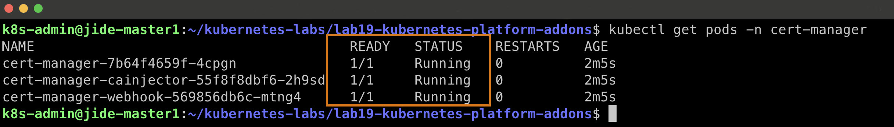
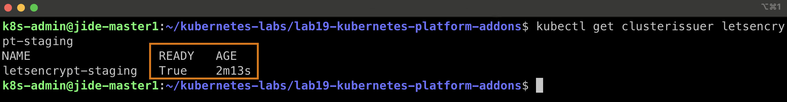
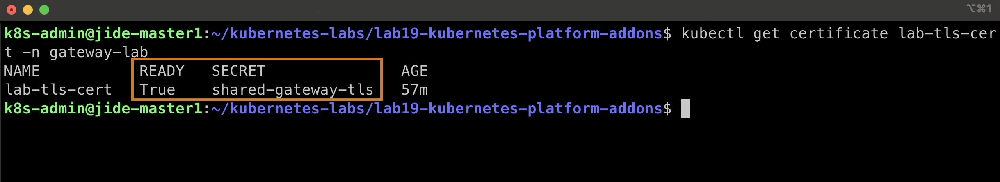
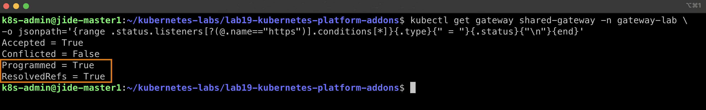
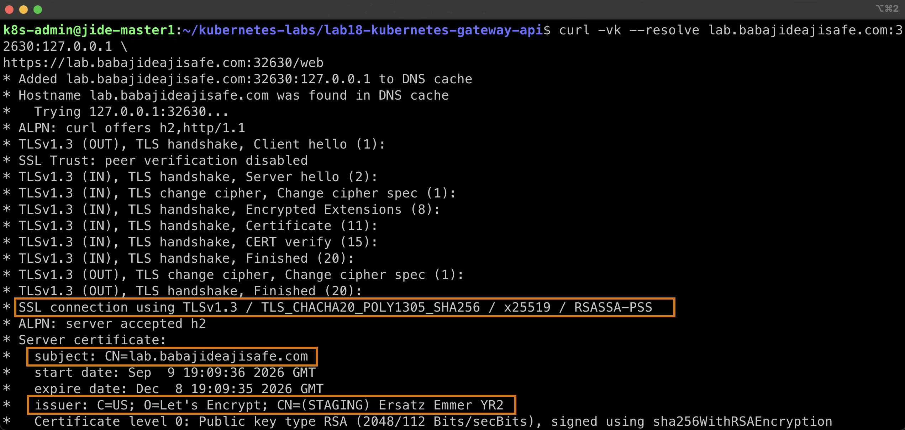
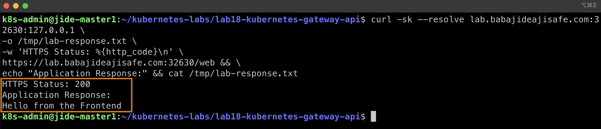
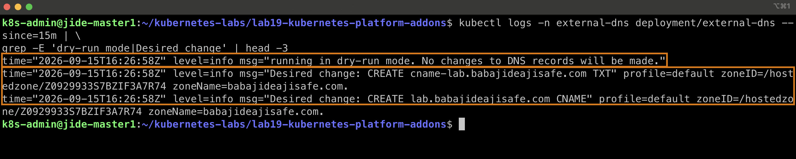
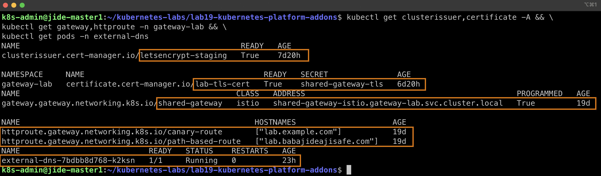

# Lab 19 — Kubernetes Platform Add-ons: cert-manager, TLS & ExternalDNS

## Overview

This lab extends the Kubernetes Gateway API environment from Lab 18 by adding production-style platform services for automated TLS certificate management and DNS automation.

The lab integrates:

- Kubernetes Gateway API
- Istio Gateway Controller
- cert-manager
- Let's Encrypt ACME
- AWS Route 53 DNS-01 validation
- ExternalDNS
- AWS IAM
- HTTPS/TLS termination

The environment runs on a self-hosted multi-node k3s Kubernetes cluster.

---

## Architecture

```text
                         Internet / DNS
                              |
                              v
                       AWS Route 53
                              |
                 +------------+------------+
                 |                         |
                 | DNS-01                  | ExternalDNS
                 | Validation              | DNS Discovery
                 v                         v
             cert-manager              ExternalDNS
                 |                         |
                 |                         |
                 v                         |
          Let's Encrypt                    |
                 |                         |
                 v                         |
        TLS Certificate                    |
                 |                         |
                 +------------+------------+
                              |
                              v
                    Kubernetes Secret
                 shared-gateway-tls
                              |
                              v
                       Istio Gateway
                    HTTP :80 / HTTPS :443
                              |
                              v
                         HTTPRoute
                              |
                  +-----------+-----------+
                  |                       |
                  v                       v
             Frontend Service         API Service
```

---

## Lab Objectives

The objectives of this lab were to:

1. Install cert-manager in the Kubernetes cluster.
2. Configure a Let's Encrypt ACME ClusterIssuer.
3. Use AWS Route 53 for DNS-01 certificate validation.
4. Request a TLS certificate for the lab domain.
5. Store the issued certificate in a Kubernetes Secret.
6. Configure the Gateway API HTTPS listener for TLS termination.
7. Validate HTTPS connectivity through the Istio Gateway.
8. Deploy ExternalDNS with AWS Route 53 integration.
9. Configure least-privilege AWS IAM access for ExternalDNS.
10. Safely validate proposed DNS changes using ExternalDNS dry-run mode.

---

## Environment

| Component | Technology |
|---|---|
| Kubernetes | k3s |
| Gateway API Controller | Istio |
| Certificate Management | cert-manager |
| Certificate Authority | Let's Encrypt Staging |
| DNS Provider | AWS Route 53 |
| DNS Automation | ExternalDNS |
| TLS Validation | DNS-01 |
| Gateway Exposure | NodePort |
| ExternalDNS Mode | Dry Run |

---

## Project Files

```text
lab19-kubernetes-platform-addons/
├── 01-clusterissuer.yaml
├── 02-certificate.yaml
├── 03-httproute-tls.yaml
├── 04-external-dns.yaml
├── README.md
└── screenshots-lab19/
    ├── 01-cert-manager-pods-running.jpg
    ├── 02-clusterissuer-ready.jpg
    ├── 03-certificate-ready.jpg
    ├── 04-https-listener-programmed-resolvedrefs.jpg
    ├── 05-tls-certificate-validation.jpg
    ├── 06-https-application-success.jpg
    ├── 07-externaldns-route53-dry-run.jpg
    └── 08-lab19-platform-addons-final-status.jpg
```

---

# Part 1 — cert-manager

cert-manager was installed in the cluster to automate certificate lifecycle management.

The cert-manager components were verified to be running successfully.



---

# Part 2 — Let's Encrypt ClusterIssuer

A cluster-wide ACME issuer named:

```text
letsencrypt-staging
```

was configured.

AWS Route 53 was used as the DNS-01 solver.

The issuer successfully reached:

```text
READY=True
```



Using DNS-01 validation allows cert-manager to prove ownership of the requested DNS names by creating temporary DNS challenge records in Route 53.

---

# Part 3 — TLS Certificate

A certificate resource named:

```text
lab-tls-cert
```

was created in the `gateway-lab` namespace.

The certificate covers:

```text
lab.babajideajisafe.com
api.babajideajisafe.com
```

The resulting TLS material is stored in the Kubernetes Secret:

```text
shared-gateway-tls
```

The certificate successfully reached:

```text
READY=True
```



---

# Part 4 — Gateway API HTTPS Listener

The existing Istio Gateway from Lab 18 was extended with an HTTPS listener on port `443`.

TLS termination uses:

```text
shared-gateway-tls
```

The Gateway successfully reported the listener as programmed and the HTTPRoute references as resolved.



The Gateway now supports both:

```text
HTTP  :80
HTTPS :443
```

---

# Part 5 — TLS Validation

TLS connectivity was tested against the HTTPS Gateway.

The TLS handshake successfully negotiated:

```text
TLSv1.3
```

The certificate subject matched:

```text
CN=lab.babajideajisafe.com
```

The issuer was the Let's Encrypt staging environment.



Because this lab intentionally uses the Let's Encrypt **staging** environment, the certificate is suitable for validating the ACME and TLS workflow but is not intended to be browser-trusted as a production certificate.

---

# Part 6 — HTTPS Application Test

After TLS configuration, application traffic was tested through the HTTPS listener.

The request returned:

```text
HTTPS Status: 200
Application Response:
Hello from the Frontend
```



This confirms the complete traffic path:

```text
HTTPS Client
     |
     v
Istio Gateway :443
     |
 TLS Termination
     |
     v
HTTPRoute
     |
     v
Frontend Service
```

---

# Part 7 — ExternalDNS with AWS Route 53

ExternalDNS was deployed to monitor Kubernetes Gateway API HTTPRoute resources.

The deployment uses:

```text
--source=gateway-httproute
--provider=aws
--domain-filter=babajideajisafe.com
--registry=txt
--policy=upsert-only
--dry-run
```

A dedicated AWS IAM identity was configured for ExternalDNS rather than sharing the cert-manager credentials.

The IAM policy was restricted to the Route 53 operations required by ExternalDNS and the relevant hosted zone where possible.

After validating the AWS identity and permissions, ExternalDNS successfully discovered the Route 53 hosted zone and calculated the desired DNS changes.



ExternalDNS proposed:

```text
CREATE cname-lab.babajideajisafe.com TXT
CREATE lab.babajideajisafe.com CNAME
```

---

## Why ExternalDNS Remains in Dry-Run Mode

The Kubernetes cluster is self-hosted and the Istio Gateway is currently exposed using a `NodePort` Service.

The Gateway status therefore advertises an internal Kubernetes hostname:

```text
shared-gateway-istio.gateway-lab.svc.cluster.local
```

The Service has:

```text
TYPE:        NodePort
EXTERNAL-IP: <none>
```

Publishing that internal `.svc.cluster.local` hostname into a public Route 53 hosted zone would create an unusable public DNS record.

For this reason, ExternalDNS intentionally remains configured with:

```text
--dry-run
```

This allows the AWS Route 53 integration to be validated safely without creating an incorrect public DNS record.

In a production environment, the Gateway would normally have a publicly reachable LoadBalancer address, cloud load balancer hostname, or another appropriate external ingress endpoint before ExternalDNS is allowed to modify public DNS records.

---

# IAM Troubleshooting

During the ExternalDNS deployment, AWS returned an authorization error for:

```text
route53:ListHostedZones
```

Troubleshooting revealed that ExternalDNS was initially using credentials associated with the cert-manager IAM identity.

A separate IAM identity was then created specifically for ExternalDNS.

The active AWS identity was verified before updating the Kubernetes Secret.

After restarting the ExternalDNS Deployment with the corrected credentials:

```text
READY:    1/1
STATUS:   Running
RESTARTS: 0
```

The previous AWS `403 AccessDenied` error disappeared and ExternalDNS successfully discovered the Route 53 hosted zone.

This reinforced the importance of:

- Dedicated workload identities
- Least-privilege IAM policies
- Verifying the active AWS identity
- Separating credentials between platform components
- Testing infrastructure automation before enabling write operations

---

# Final Validation

The final environment showed:

```text
ClusterIssuer   letsencrypt-staging   READY=True

Certificate     lab-tls-cert
                READY=True

Gateway         shared-gateway
                PROGRAMMED=True

HTTPRoute       lab.babajideajisafe.com

ExternalDNS     1/1 Running
                0 Restarts
```



---

# Key Takeaways

This lab demonstrated how Kubernetes platform services can automate certificate and DNS operations around Gateway API workloads.

Key concepts practiced include:

- Kubernetes Gateway API
- Istio Gateway Controller
- TLS termination
- cert-manager
- ACME certificate automation
- DNS-01 validation
- AWS Route 53 integration
- ExternalDNS
- AWS IAM least privilege
- Kubernetes Secrets
- Kubernetes RBAC
- Troubleshooting AWS authorization failures
- Safe infrastructure testing with dry-run
- Understanding internal Kubernetes addressing versus public DNS

---

# Result

Lab 19 successfully integrated cert-manager, Let's Encrypt, AWS Route 53, Istio Gateway API, HTTPS, and ExternalDNS into the k3s platform.

Certificate issuance and HTTPS routing are operational.

ExternalDNS successfully authenticates to AWS and discovers the required DNS changes while remaining intentionally in dry-run mode until the Gateway has an appropriate publicly reachable endpoint.

---

# Created

## Babajide Ajisafe

Cloud | DevOps | Kubernetes

GitHub: https://github.com/bojide

LinkedIn: https://linkedin.com/in/babajide-ajisafe

---

Passionate about designing, automating, and managing scalable cloud-native infrastructure using Kubernetes, Docker, Terraform, AWS, and modern DevOps practices.
