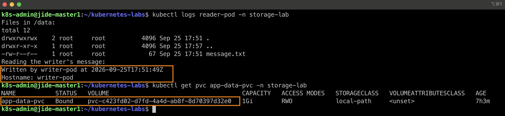
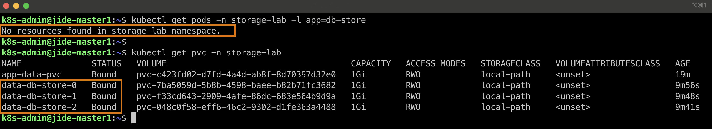
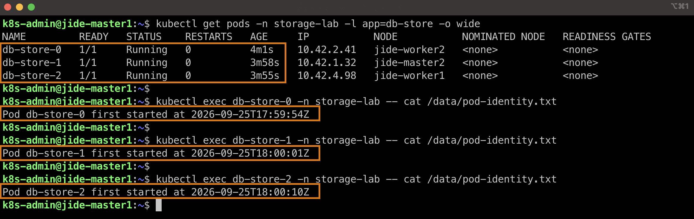

# Lab 20 — Persistent Storage on k3s

## Overview

This lab demonstrates how Kubernetes storage survives the deletion or replacement of a Pod. I first wrote a file through a PersistentVolumeClaim (PVC), deleted the writer Pod, and read the same file from a new Pod. I then used a StatefulSet to give three replicas separate PVCs and verified that their data survived scaling the StatefulSet down to zero and back up.

The original exercise was written for GKE and its `standard` StorageClass. My five-node k3s cluster uses the `local-path` StorageClass, so I adapted the manifests for my environment.

## Objectives

1. Create a PVC using the cluster's `local-path` StorageClass.
2. Observe why the PVC initially remains `Pending`.
3. Write data to the PVC from a Pod.
4. Delete that Pod and read the original data from a second Pod.
5. Give each StatefulSet replica its own PVC with `volumeClaimTemplates`.
6. Scale the StatefulSet to zero and verify that its PVCs remain.
7. Scale back up and confirm that the original files are still present.

## Environment

| Component | Configuration |
|---|---|
| Kubernetes distribution | k3s |
| Cluster | Five nodes |
| Namespace | `storage-lab` |
| StorageClass | `local-path` |
| Provisioner | `rancher.io/local-path` |
| Volume binding mode | `WaitForFirstConsumer` |
| Reclaim policy | `Delete` |
| Access mode | `ReadWriteOnce` |
| Requested capacity | 1 GiB per PVC |

The `local-path` provisioner stores a volume on a particular node. This lab demonstrates persistence across Pod replacement while that node remains available. It does not demonstrate recovery from losing the node that holds the data.

## Project files

| File | Purpose |
|---|---|
| `01-pvc.yaml` | Creates the shared `app-data-pvc` claim. |
| `02-writer-pod.yaml` | Writes `/data/message.txt` to the shared PVC. |
| `02-reader-pod.yaml` | Reads the writer's file from the same PVC. |
| `03-statefulset-storage.yaml` | Creates a headless Service and a three-replica StatefulSet with one PVC per replica. |
| `screenshots-lab20/` | Contains the three screenshots documenting the results. |

## Part 1 — Create the PVC

I created the `storage-lab` namespace and applied `01-pvc.yaml`:

```bash
kubectl create namespace storage-lab
kubectl apply -f 01-pvc.yaml
kubectl get pvc -n storage-lab
```

The claim `app-data-pvc` initially showed `Pending`. The `local-path` StorageClass uses `WaitForFirstConsumer`, so Kubernetes waited for a Pod that needed the claim before choosing a node and provisioning its volume.

After I created the writer Pod, the PVC became `Bound` to a dynamically created PersistentVolume (PV).

## Part 2 — Write data and replace the Pod

I applied `02-writer-pod.yaml`. The writer mounted `app-data-pvc` at `/data` and created `/data/message.txt`.

```bash
kubectl apply -f 02-writer-pod.yaml
kubectl logs writer-pod -n storage-lab
kubectl exec writer-pod -n storage-lab -- cat /data/message.txt
```

The file contained the writer's identity and creation time:

```text
Written by writer-pod at 2026-09-25T17:51:49Z
Hostname: writer-pod
```

I deleted the writer Pod, then created the reader Pod using `02-reader-pod.yaml`:

```bash
kubectl delete pod writer-pod -n storage-lab
kubectl apply -f 02-reader-pod.yaml
kubectl logs reader-pod -n storage-lab
kubectl get pvc app-data-pvc -n storage-lab
```

The reader displayed the writer's original message, and `app-data-pvc` was still `Bound`. This confirms that deleting the writer Pod did not delete the claim or its data.



## Part 3 — Give each StatefulSet Pod its own PVC

I applied `03-statefulset-storage.yaml`, which defines a headless Service and the `db-store` StatefulSet:

```bash
kubectl apply -f 03-statefulset-storage.yaml
kubectl rollout status statefulset/db-store -n storage-lab --timeout=180s
kubectl get pods -n storage-lab -l app=db-store -o wide
kubectl get pvc -n storage-lab
```

The StatefulSet's `volumeClaimTemplates` created a separate claim for each replica:

| Pod | PVC |
|---|---|
| `db-store-0` | `data-db-store-0` |
| `db-store-1` | `data-db-store-1` |
| `db-store-2` | `data-db-store-2` |

Each Pod wrote its own `/data/pod-identity.txt` file. I read the files with:

```bash
kubectl exec db-store-0 -n storage-lab -- cat /data/pod-identity.txt
kubectl exec db-store-1 -n storage-lab -- cat /data/pod-identity.txt
kubectl exec db-store-2 -n storage-lab -- cat /data/pod-identity.txt
```

The first-start timestamps were different for each Pod:

| Pod | Original timestamp |
|---|---|
| `db-store-0` | `2026-09-25T17:59:54Z` |
| `db-store-1` | `2026-09-25T18:00:01Z` |
| `db-store-2` | `2026-09-25T18:00:10Z` |

## Part 4 — Scale down and verify PVC retention

I scaled the StatefulSet to zero replicas and waited for its Pods to disappear:

```bash
kubectl scale statefulset db-store -n storage-lab --replicas=0
kubectl get pods -n storage-lab -l app=db-store
kubectl get pvc -n storage-lab
```

There were no `db-store` Pods, but all three `data-db-store-*` PVCs remained `Bound`. The separate `app-data-pvc` also remained `Bound`.



## Part 5 — Scale up and verify the original data

I scaled the StatefulSet back to three replicas and waited for the rollout:

```bash
kubectl scale statefulset db-store -n storage-lab --replicas=3
kubectl rollout status statefulset/db-store -n storage-lab --timeout=180s
kubectl get pods -n storage-lab -l app=db-store -o wide
```

The new Pods had new IP addresses. Each Pod still read its original identity file from its own PVC; the original first-start timestamps remained `17:59:54Z`, `18:00:01Z`, and `18:00:10Z`.



## Results

| Test | Observed result |
|---|---|
| PVC created before a Pod used it | `app-data-pvc` initially remained `Pending`. |
| Writer Pod requested storage | `app-data-pvc` became `Bound`. |
| Writer Pod deleted and reader Pod created | Reader found the writer's original message. |
| StatefulSet created with three replicas | Kubernetes created three separate `data-db-store-*` PVCs. |
| StatefulSet scaled to zero | Pods disappeared while their PVCs stayed `Bound`. |
| StatefulSet scaled back to three | Pods read their original identity files and timestamps. |

**Outcome:** The lab confirmed that a PVC has a lifecycle separate from the Pod using it. The StatefulSet's `volumeClaimTemplates` gave each replica its own persistent storage.

## Key takeaways

- A PVC is a request for storage; a PV represents the storage that fulfills the request.
- With `WaitForFirstConsumer`, a PVC may remain `Pending` until a Pod needs it.
- Deleting a Pod does not automatically delete its PVC or the data stored through that PVC.
- A StatefulSet creates a distinct PVC for each replica when configured with `volumeClaimTemplates`.
- Scaling a StatefulSet to zero retains its PVCs under the configuration tested in this lab.
- `local-path` storage is tied to a node. This test does not establish node-failure recovery.
- The observed PV reclaim policy was `Delete`. Deleting these PVCs triggers removal of their PVs and local data.

## Created by

**Babajide Ajisafe**  
Cloud | DevOps | Kubernetes

GitHub: [github.com/bojide](https://github.com/bojide)  
LinkedIn: [linkedin.com/in/babajide-ajisafe](https://linkedin.com/in/babajide-ajisafe)

Passionate about designing, automating, and managing scalable cloud-native infrastructure using Kubernetes, Docker, Terraform, AWS, and modern DevOps practices.
